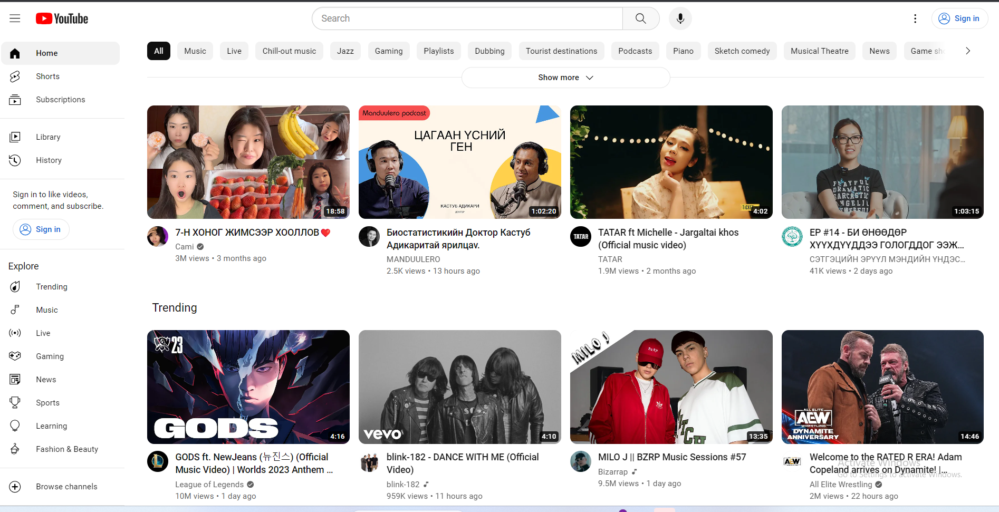
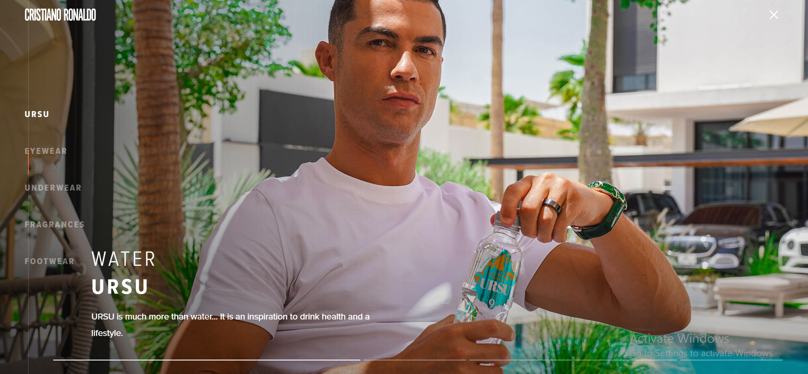
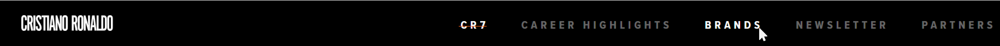

# Хичээл 5-1:

# Hands-on

### 1. Google fonts: <https://fonts.google.com/>

### 2. SVG Icons: <https://fonts.google.com/icons>, <https://www.flaticon.com/> ..

### 3. CSS Transform 
#### hover буюу mouse дээгүүр нь явах үед ажиллах төлөв
```sh
.class:hover{
  background-color: gold;
}
```

#### rotate() - Тэнхлэгээр эргүүлэх
- transform: rotate(90deg) rotate(-90deg)
#### scale() - Томруулах эсвэл жижигрүүлэх
- transform: scale(0.5) scale(1.5)
#### skew() - Хазайлгана
- transform: skew(90deg) - Зүүн талруу хазайлгана
- transform: skew(-90deg) - Баруун талруу хазайлгана
#### translate() - Байрлалыг x,y,z тэнхлэгт хөдөлгөнө
- transform: translate(10px) - Хэвтээ тэнхлэгийн дагуу хөдлөнө
- transform: translate(10px, 10px) - Босоо тэнхлэгийн дагуу баруун тийш
- transform: scale(1.5) translateX(10px) - Хамт хэрэглэх боломжтой

### 4. CSS Transitions: transition: (duration, timing type, delay)
- transition: 0.5s - Өөрчлөгдөх хугацаа
- transition: 0.5s ease-in - Өөрчлөгдөх хугацаа,
- transition: 0.5s ease-in 1s - Өөрчлөгдөх хугацаа,
- transition: 0.5s, background 1s - Өөрчлөгдөх хугацаа, өөрчлөгдөх утга property утга
- linear
- ease-in
# Дасгал ажил:

### 1. Өмнөх хичээл дээр хийсэн Youtube хуудас дээр icon, font, hover transition зэргийг нэмээд илүү ижилхэн болгоорой.



    - 1-р дасгалыг хийхэд:
            - SVG icon-уудыг lesson8/icons хавтаснаас татаж аваарай
            - Icon-уудийн хэмжээ 24px*24px байна
            - Youtube хуудас нь Roboto гэсэн фонттой байгаа
            - left талын hover color: #f2f2f2
            - sign in талын hover color: #def1ff
            - sign in талын font color: #2269ca

### 2. Өөрсдын веб хуудасанд тохирох фонтыг оруулаарай.

- Жишээ нь:

  

- Жишээ веб: https://www.cristianoronaldo.com

### 3. Өөрсдын веб хуудасны холбоо барих хэсэгт тохирох icon-г оруулаарай.

- Жишээ нь:

  

### 4. Өөрсдийн вэб хуудсаны menu хэсгийг дараах жишээ шиг шинэчлээрэй.

- Жишээ нь:



    - Tip:
            - example хавтсанд байгаа жишээг ашиглаарай.
            - бичсэн кодоо хадгалсан эсэхээ шалгаарай.
            - head хэсэгт css файлаа холбосон эсэхээ шалгаарай.
            - асуулт гарж ирвэл багшийгаа дуудаарай. 😉

<!-- ### 1. Дуртай кино, анимэ-н жагсаалт, дүрүүдийн танилцуулга, тоглоомын баатрын танилцуулга, дуртай спорт багийн тамирчдын танилцуулга зэрэг зүйлсийг багтаасан шинэ хуудас үүсгэн flexbox ашиглан загварчлаарай


### 2. Өөрсдийн вэб сайтаа flexbox-оор загварчлан сайжруулаан зураарай

## Жишээ нь


## Нэмэлт дасгал

### Шинээр үүсгэсэн хуудсандаа арай өөрөөр flexbox ашигласан хэсэг нэмээрэй

## Жишээ нь

 -->
