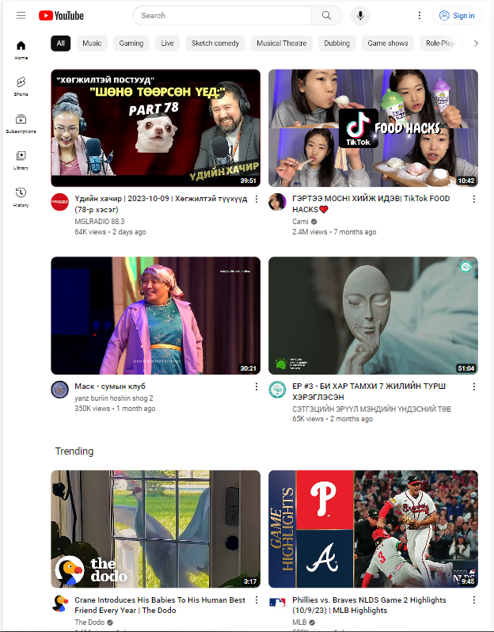

# Хичээл 5-2:

### Slide: https://docs.google.com/presentation/d/1L7GHm_2rAKYIAGYnYz-btr1V8qjpPXXoasmzHAHpWRs/edit?usp=sharing
 
### Өмнөх 7 хоногийн бататгах тест: https://kahoot.it/ пассийг багш хэлнэ.

# Hands-on
- 320px — 480px: Mobile devices
- 481px — 768px: iPads, Tablets
- 769px — 1200px: Small screens, laptops
- 1201px and more —  Extra large screens, Desktop

### 1. Responsive design

```sh 
@media screen and (max-width: 600px) {

}

@media screen and (min-width: 600px) 
and (max-width: 600px) {

}


```

# Дасгал ажил:

### 1. Өмнөх хичээл дээр хийсэн Youtube хуудас-аа гар утас, таблет дээр харуулж загварчилна.

### Жишээ нь:

- Утсан дээр:


- Таблет дээр



- 1-р дасгалыг хийхэд:
  - inspect-ээр гар утсан дээр хэрхэн харагдахыг нь слайд дээр оруулсаны дагуу хараарай.
 