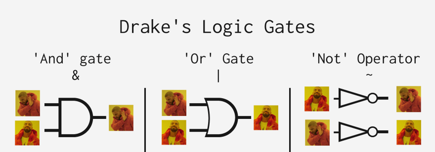
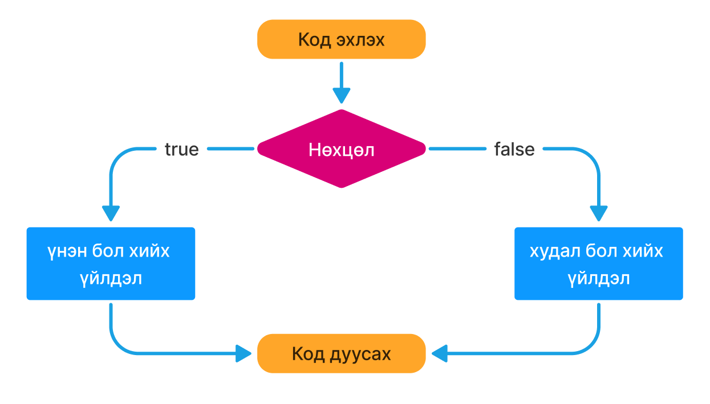
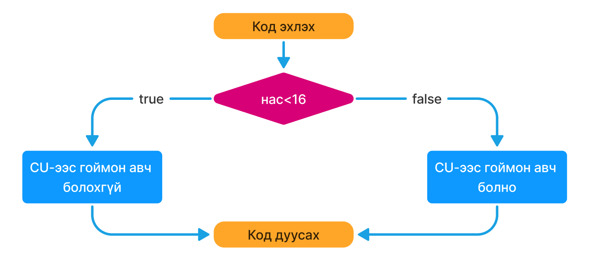
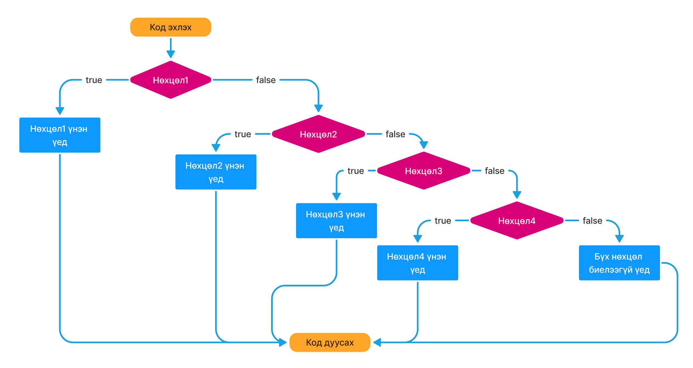
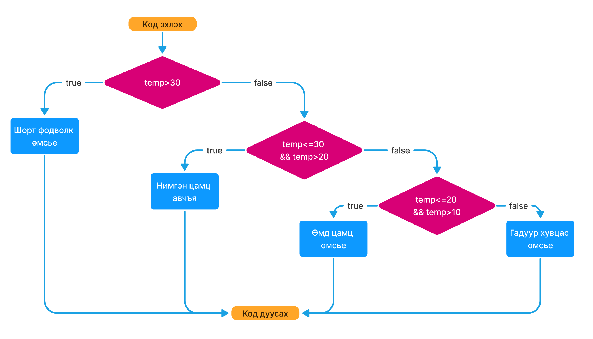

# 6 - 2:
 

# Hands-on

### Жиших үйлдлүүд (Comparison Operators)

`x = 3`

- x > 3 `=> false`
- x >= 3 `=> true`
- x < 3 `=> false`
- x <= 3 `=> true`
- x === 3 `=> true` (Төрөл + утга), x == 3 (Зөвхөн утга)
- x !== 3 `=> false`

#

- x === 3 (Төрөл + утга)
- x == 3 (Зөвхөн утга):

### Логик үйлдлүүд

- && : and буюу бүгд биелэж байх үед "үнэн"
- || : or буюу аль нэг нь л биелэх үед "үнэн"
- ! : not буюу үнэн үед "худал", худал үед "үнэн"

  

```sh
    const skills = {
    frontend: true,
    backend: true,
    };
    # Ажлын зар fullstack хөгжүүлэгч авна
    let isFullstack = skills.frontend && skills.backend;
    # Үгүйсгэл (!)
    let notAccepted = !isFullstack

    # frontend, backend хөгжүүлэгч авна:
    let isDeveloper = skills.frontend || skills.backend;
    let notAccepted = !isDeveloper

```

### if else

- if-else block schema:

  

```sh
if(condition)
  console.log('condition биелэх үед');
else
  console.log('condition биелээгүй үед');
```

- if-else block schema жишээ:

  

```sh
if(age<16)
  console.log('CU-с гоймон авч болохгүй');
else
  console.log('CU-с гоймон авч болно');
```

- if-else-if... буюу үргэлжилсэн if-else
  

```sh
if(condition_1)
    console.log('condition_1 биелэх үед');
else if(condition_2){
    console.log('condition_2 биелэх үед.');
    ...
}
else
    console.log('Өмнөх нөхцөлүүд биелэхгүй үед ажиллана.');
```

- if-else-if... жишээ:
  

```sh
if (temperature > 30) {
  console.log("Шорт фодволк өмсье");
} else if (temperature <= 30 && temperature > 20 ) {
  console.log("Нимгэн цамц авчъя");
} else if (temperature <= 20 && temperature > 10) {
  console.log("Өмд цамц өмсье");
} else {
  console.log("Гадуур хувцас өмсье");
}
```

# Дасгал ажил:

### 1. if-else ашиглан гараас өгсөн 2 тооны ихийг олж console-руу харуулна уу.
#### Жишээ нь:
  1. a=56, b=78 байх үед
  - Үр дүн: "а тоо их байна"
  2. a=10, b=9 байх үед
  - Үр дүн: "b тоо их байна"

### 2. x тоог тэгш эсвэл сондгойг эсэхийг шалгаж console-руу хэвлэнэ үү.
Жишээ нь:
- x = 57349
- Үр дүн: сондгой
- Tip: тэгш сондгойг 2-т хуваагдаж байна уу үгүй юу гэдгээр нь тодорхойлно. Үүнийг **x%2===0** гэж шалгаж болно.

### 3. Хэрэглэгч нууц үгээ мартсан тул шинээр сольж байгаа бөгөөд шинэ нууц үгээ давтан оруулж 2 нууц үг хоорондоо ижил бичсэн байна уу шалгаж баталгаажуулах хэрэгтэй. 

- Гараас newPassword, confirmNewPassword гэсэн 2 хувьсагчинд утга авна.
- Нууц үгүүд хоорондоо ижил байвал => "Нууц үг амжилттай солигдлоо" гэж хэвлэнэ.
- Нууц үгүүд хоорондоо таарахгүй байвал => "Нууц үгээ зөв давтаж оруулаарай" гэж хэвлэнэ.

### 4. point хувьсагчид 0-100 хооронд оноо өгөх бөгөөд тухайн оноо нь ямар дүн авсныг if-else ашиглан console-руу хэвлэ.

      - 90 : 'A'
      - 80 - 89: 'B'
      - 70 - 79: 'C'
      - 60 - 69: 'D'
      - < 60 : 'F'
      гэж хэвлэнэ.

Жишээ нь: point = 78
- Үр дүн: "C"

### 5. Гараас өгсөн x тооны утга дараах нөхцөл биелэж байх үед тохирох текст хэвлэнэ.

- x тоо 3-д, 5-д хоёуланд нь хуваагдаж байвал => "FizzBuzz" гэж хэвлэнэ.
- x тоо зөвхөн 3-д хуваагдаж байвал => "Fizz" гэж хэвлэнэ.
- x тоо зөвхөн 5-д хуваагдаж байвал => "Buzz" гэж хэвлэнэ.
- x тоо 3, 5-н алинд нь ч хуваагдахгүй байвал => "input" гэж хэвлэнэ.
- Бусад тохиолдолд => 'Not number' гэж хэвлэнэ.
  - Жишээ нь:
    - x = 9   үед 
      - Үр дүн: "Fizz"
    - x = 25  үед 
      - Үр дүн: "Buzz"
    - x = 15  үед 
      - Үр дүн: "FizzBuzz"
    - x = 79  үед 
      - Үр дүн: "input"
    - x = "sdh"  үед 
      - Үр дүн: "Not number"

### 6. Замын цагдаагаас хурд хэтрүүлсэн эсэхийг шалгадаг програм зохиолгох хүсэлт ирлээ. Програмын шаардлага:

- Хурдны дээд хязгаар 80км/цаг
- Тухайн хурднаас 5км цаг хэтрэх бүрт 1 оноо хасах бөгөөд хэрэв 5 оноо алдах юм бол эрхээ хасуулна.
- Жишээ нь:
  - Оролт: speed = 100;
  - Гаралт: 4 оноо алдсан. Эрх хасагдаагүй.
- Жишээ нь:
  - Оролт: speed = 120;
  - Гаралт: 8 оноо алдсан. Эрх хасагдсан.
