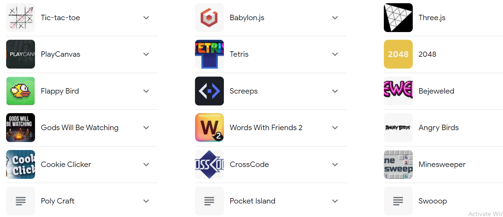

# Хичээл 6-1:

<!-- ### Slide: https://docs.google.com/presentation/d/1wkwgQtmi6w7o-X3EIntAIBVdHE9a91AdeUzOeYMbJtQ/edit?usp=sharing -->
 
# Hands-on

### 1. Javascript гэж юу вэ?
- Энэ нь дэлхий дээрхи хамгийн өргөн хэрэглэгдэж буй програмын хэл. Netflix, Twitter, Paypal, Uber, Yahoo..
- Javascript хөгжүүлэгчийн цалин:
- 
- Javascript юу хийдэг вэ?
    - Гар утас апп
    - Веб 
    - Realtime (чат), 
    - Streaming (netflix) 
    - Game
    


### 2. filename.js -р төгссөн файл үүсгэнэ. Жишээ нь: main.js

- Дотор нь "Hello world" гэсэн текстийг console-руу хэвлэх код бичье. 


### 3. HTML дээр холбож ажиллуулах
    <script src="main.js"></script>


- HTML файл дээр холболтоо хийгээд HTML -ээ асаах юм бол javascript код-г  давхар ажиллуулна. Console хэсгээс үр дүнг харах боломжтой 
 
### 3. Inspect tool-н console-той ажиллах
Бичсэн кодоо шалгахын тулд ашиглана.
- Inspect => Console
- 

### 4. Javascript variables: Хувьсагч зарлах
    - Өөрчилж болдог хувьсагч зарлах
    let x = 5;
    let name = 'Ану';
    - Тогтмол буюу утгийг нь өөрчилж болдоггүй хувьсагч
    const pi = 3.14;
### 5. Javascript data types: Хувьсагчид оноож болох өгөгдлийн төрөл
    - string: Текст => 'This is string'
    - number: Тоо => 100
    - boolean: Үнэн, худал => true, false
    - object: Бүхэл утга => {}
    - array: Цуваа => []

### 6. Javascript operators:

    - arithmetic operations (+, -, *, /, %)
    - x = x+1
    - x++, x+=3

# Дасгал ажил:

### 1. Нэр насаа хэвлэх

    - name, age гэсэн 2 хувьсагч үүсгэж нэр, насаа хадгалаад доорхи байдлаар хэвлэж харуулаарай.

```sh
console.log("Намайг " + name+ " гэдэг. Би " + age + " настай.")
```

    - Жишээ нь
        - оролт: Mike, 15
        - гаралт: Намайг Mike гэдэг. Би 15 настай.

### 2. Дараах өгөгдөлүүдийг төрлөөр нь ялга:

        - "Hello", true, "Name", 33, "90", 90+"77", "codely"+"academy", false, 1655/5, "javascript" дараах байдлаар бичээд таслалын хойно төрлийн нэрийг бичнэ.

```sh
    console.log("Hello",  )
    console.log(true,  )
    console.log("Name",  )
    console.log(33,  )
    console.log("90",  )
    console.log(90+"77",  )
    console.log( {name:'Anu', age:15},  )
    console.log(false,  )
    console.log(1655/5,  )
    console.log(["javascript", "html", "css"])
```

    - Жишээ нь
        - console.log("World", "string" )

### 3. Хувьсагчийн байрыг солих

    - a='cola', b='water' байгаа бол хувьсагчийн байрыг сольж a -г 'water', b -г 'cola' утгатай болгоно уу.
    - Жишээ нь:
        - оролт: x=5, y=6
        - гаралт: x=6, y=5
    - x=2, y=6, z=3 байгаа бол тоон утга оноохгүйгээр x=6, y=3, z=2 болго.
    
### 4. Өгөгдсөн илэрхийллийн утгыг ол. A=B\*C-D ( B, C, D утгийг гараас авна)

    - Илэрхийллийн бичиглэлийг өөрчлөхгүйгээр зөвхөн B,C,D-н утгыг өөрчлөхөд илэрхийллийн хариу үнэн байхаар хийнэ. Илэрхийллийн хариугаа дараах байдлаар бичиж шалгана.

```sh
console.log(A);
```

    - Жишээ нь
        - оролт: B=6, C=3, D=2
        - гаралт: A=16

### 5. Гараас хоног, цаг өгсөн бол нийт цаг болохыг олдог тооны машин хийгээрэй

    - day буюу хоног, time буюу цаг өгсөн 2 хувьсагч байх ба нийт хэдэн цаг байгааг тооцон totalTime хувьсагчид хадгалан харуулаарай.

```sh
console.log(totalTime);
```

    - Жишээ нь
        - оролт: day=2, time=10
        - гаралт: totalTime=58

### 6. Хэдэн онд хэдэн настай байхаа бодуулдаг нас боддог тооны машин хийгээрэй.

    - futureYear буюу насаа харах гэж буй онийг хадгалдаг 1 хувьсагч, bornYear буюу төрсөн оноо хадгалдаг нэг хувьсагч үүсгэн бодно.
    - Жишээ нь
        - оролт: futureYear= 2040, bornYear=1999
        - гаралт: 41

### 7. Төрсөн оноо оруулахад өнөөдрийг хүртэл хэдэн өдөр амьдарснаа тооцдог тооцоолуур хийгээрэй.

    - bornYear буюу төрсөн оноо хадгалдаг хувьсагч, bornMonth буюу төрсөн сараа хадгалдаг хувьсагч, bornDay буюу төрсөн өдрөө хадгалдаг хувьсагч үүсгэн бодно.
    - Жишээ нь
        - оролт: bornYear=2003, bornMonth=3, bornDay=20
        - гаралт: 7597

### 8\*. Тонгорогсон тоо: Өгөгдсөн 4 оронтой тооны тонгорогсон тоог ол. (parseInt, %-г ашиглана)

    -parseInt нь бүхэл тоог авдаг. a = parseInt(6.5) гэвэл a=6 болж ажилдаг.
    - % нь хуваагаад бутархай хэсгийг авдаг. b=13%10 гэвэл b=3 болж ажилдаг.
    - Жишээ нь
        - оролт: 1234
        - гаралт: 4321

    - Tip:
            - example хавтсанд байгаа жишээг ашиглаарай.
            - бичсэн кодоо хадгалсан эсэхээ шалгаарай.
            - javascriptee холбосон эсэхээ шалгаарай
