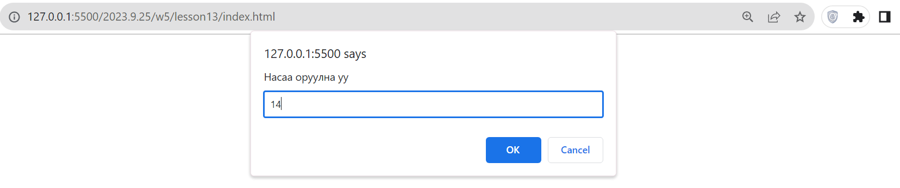
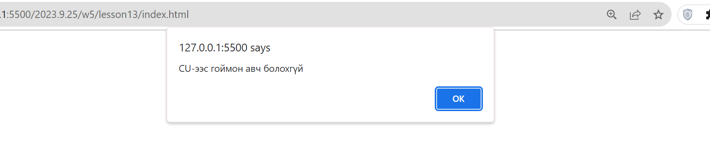
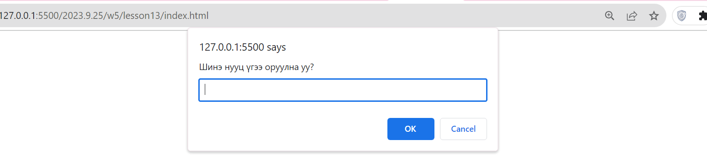
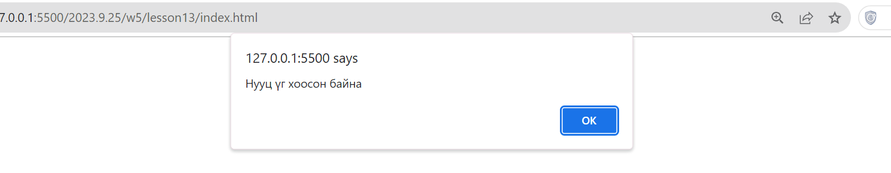
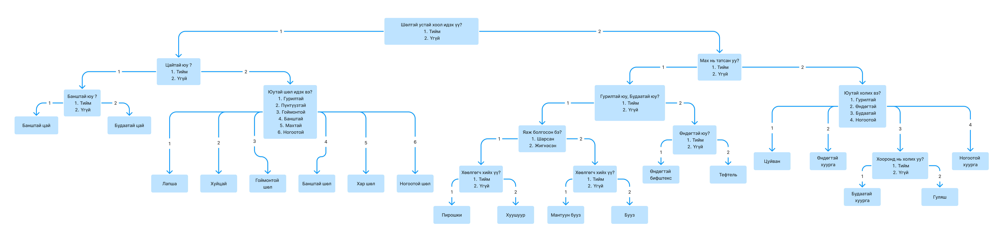
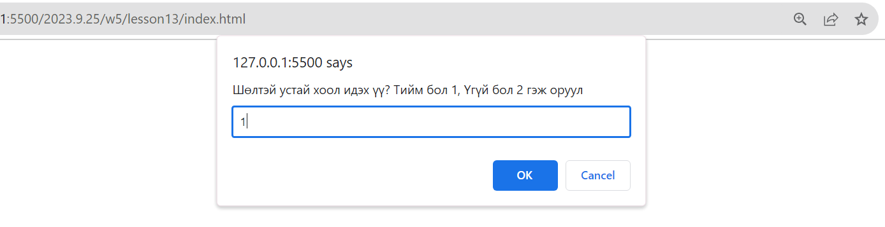
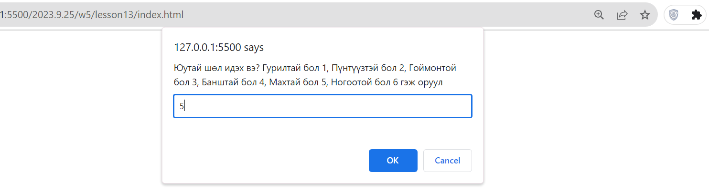
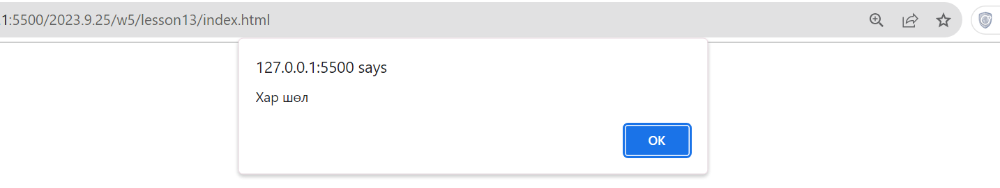
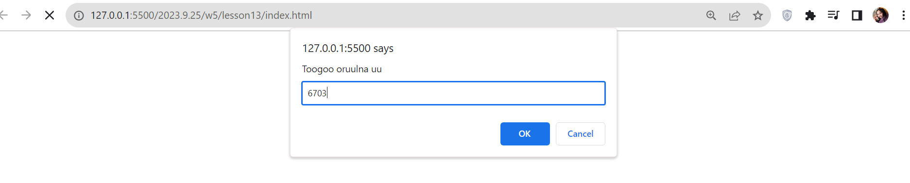
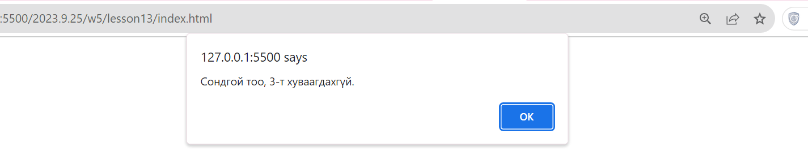

# 6 - 2: Давтлага хичээл
 
### prompt:
- Хувьсагчид prompt ашиглан утга авах:
### alert
- Програмын үр дүнг дэлгэцэнд харуулах:
```sh
let number = prompt("Тоогоо оруулна уу");
alert("Таны оруулсан тоо бол:"+number);
```
# Дасгал ажил:
 
### 1. age хувьсагчинд prompt ашиглан насыг нь аваад:

- 16-с доош настай бол alert ашиглан CU-с гоймон авч болохгүй

- 16 ба түүнээс дээш настай бол alert ашиглан CU-с гоймон авч болно гэж харуул.
- Жишээ нь:
  
  

### 2. Login хэсэгт хэрэглэгч шинээр нууц үгээ солихдоо давтан оруулах бөгөөд энэхүү 2 нууц үг хоорондоо ижил байна уу шалгана.

- newPassword хувьсагчинд prompt ашиглан хэрэглэгчээс нууц үгийг аваад хоосон эсэхийг шалгана.
- Хоосон тохиолдолд alert ашиглан "Нууц үг хоосон байна" гэж харуулна
- Хоосон биш тохиолдолд prompt ашиглан хэрэглэгчээс confirmNewPassword хувьсагчинд шинэ нууц үгийг давтан оруулахыг хүснэ.
- Нууц үгүүд хоорондоо ижил байвал alert ашиглан "Нууц үг амжилттай солигдлоо" гэж харуулна.
- Нууц үгүүд хоорондоо таарахгүй байвал alert ашиглан "Нууц үгээ зөв давтаж оруулаарай" гэж харуулна.
  - Hint: Хоосон байна уу гэдгийг ""-тэй тэнцүүлж шалгана.
  - Жишээ нь:
      
    

### 3. Доорхи схемийн дагуу үйлчлүүлэгчийн ямар хоол идмээр байгааг мэдэн захиалга авдаг рестораны програм зохионо. Сонголтуудийг тоогоор илэрхийлэн javascript prompt ашиглан хэрэглэгчээс авна.



- Жишээ нь дараах байдлаар оруулан хэрэглэгчийн хүссэн хоолыг олж өгнө.
  
  
  
  

### 4. n гэсэн хувьсагчинд prompt ашиглан 4 оронтой тоо авч:

- n тоо сондгой тохиолдолд 3-т хуваагдах тооны шинж ашиглан 3-т хуваагдаж байгаа эсэхийг,
- n тоо тэгш тохиолдолд 4-т хуваагдах тооны шинж ашиглан 4-т хуваагдаж байгаа эсэхийг шалгадаг програм зохио.

- 3-т хуваагдах тооны шинж: цифрүүдийн нийлбэр 3-т хуваагдаж байвал тэр тоо 3-т хуваагдана.
- 4-т хуваагдах тооны шинж: сүүлийн 2 орон нь 4-т хуваагдаж байвал тэр тоо 4-т хуваагдана.
- Hint: 3-т хуваагдах тооны шинжийг бодохын тулд цифр цифрээр нь салгах хэрэгтэй үүнд ParseInt ашиглаарай
  - Жишээ нь:
    
    
  - Оролт : 6703 => Гаралт: Сондгой тоо, 3-т хуваагдахгүй.
  - Оролт : 8000 => Гаралт: Тэгш тоо, 4-т хуваагдана. гэх мэт

<!-- <https://old.wheelofnames.com/> -->
