# Хичээл 07-2:
   

### for loop:

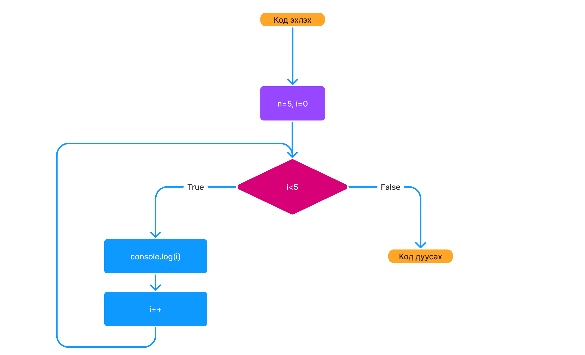

```sh
for (let i = 1; i <= 5; i++) {
    # 1. i = 1 буюу давталтаа тоолох хувьсагчийн анхны утгийг зааж өгч байна. (энэ тохиолдолд давталт 1-ээс эхлэнэ.)
    # 2. i <= 5 буюу давталт энэ нөхцөл үнэн байх үед {} хаалтан дотор байгаа үйлдлийг хийнэ. Худал бол давталт дуусна.
    # 3. {} хаалтан доторхи үйлдлийг хийсэн бол i++ буюу i-ийн утгыг 1-ээр нэмэгдүүлээд 2-р алхамруу шилжиж 5-с бага эсэхийг дахин шалгана. (i-ийн утгыг хүссэнээрээ нэмэгдүүлж болох ба энэ нь давталтын алхамыг илэрхийлнэ)
    console.log("Давталт №", i);
}
```


- Хязгааргүй давталт => хэзээ ч дуусдаггүй давталт буюу нэг төрлийн жижиг вирус болно.

```sh
  for(let i=0; true; i++) {}
```

- Flowgorithm платформ дээр [loop-example.fprg](loop-example.fprg) -ийг гаргаж харуулна.
  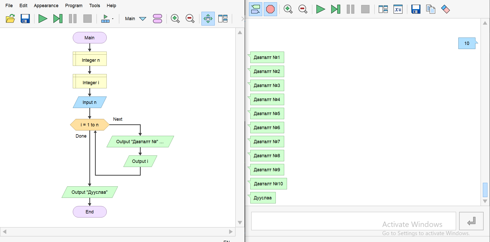

<!-- - Жүжиглэлт -->

# Дасгал ажил:

### 1. prompt ашиглан хэрэглэгчээс n хувьсагчийн утгийг авч console-руу n удаа "Codely №1" гэж дараах байдлаар хэвлэн харуулаарай.

#### Жишээ нь:

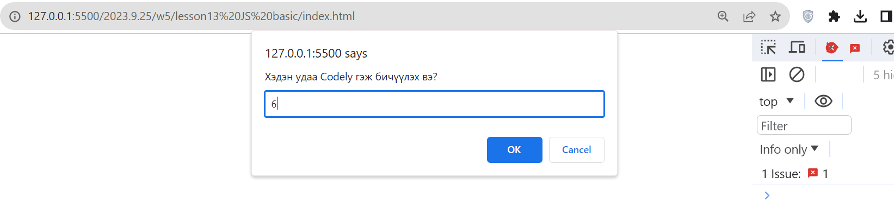
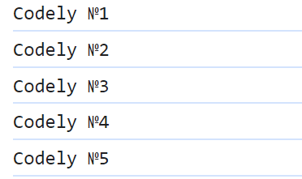

### 2. prompt ашиглан хэрэглэгчээс n хувьсагчийн утгийг авч console-руу n-ээс эхлэн 1 хүртэл тоонуудыг дараах байдлаар хэвлэн харуулаарай

#### Жишээ нь:

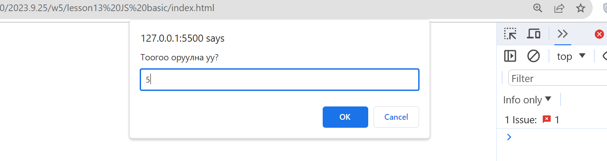
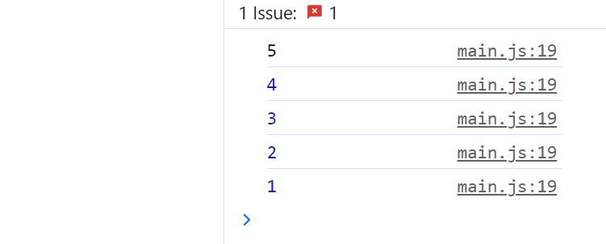

### 3. prompt ашиглан хэрэглэгчээс n гэсэн тоог авч n хүртэлх тооны нийлбэрийг олж alert ашиглан харуулаарай

#### Жишээ нь:

- Оролт: 6
- Гаралт: 1+2+3+4+5+6 буюу 21 гэж харуулна.

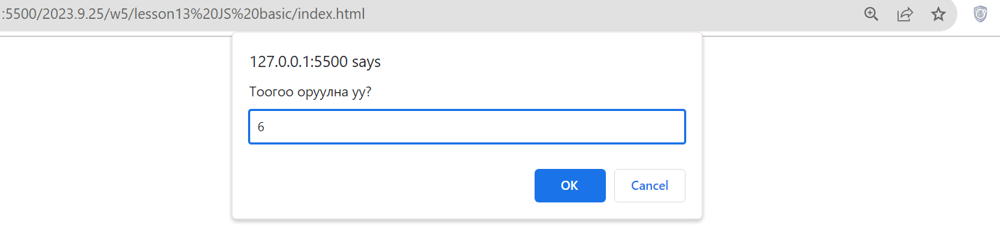
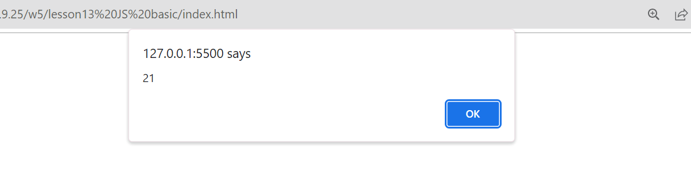

### 4. prompt ашиглан хэрэглэгчээс n гэсэн тоог авч n хүртэлх ТЭГШ тооны нийлбэрийг олж alert ашиглан харуулаарай

#### Жишээ нь:

- Оролт: 6
- Гаралт: 2+4+6 буюу 12 гэж харуулна.


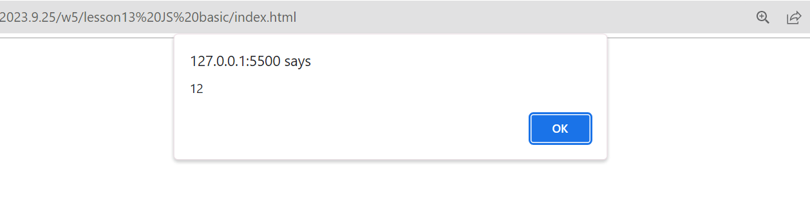

### 5. prompt ашиглан хэрэглэгчээс n гэсэн тоог авч n хүртэлх 3 эсвэл 5 -д хуваагддаг тооны нийлбэр олж alert ашиглах харуулаарай.

#### Жишээ нь:

- Оролт: 6
- Гаралт: 3+5+6 буюу 14 гэж харуулна.


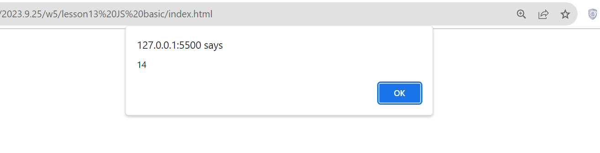

<!-- ### 6. prompt ашиглан хэрэглэгчээс n гэсэн тоог авч 1-n ширхэг \*-ийг console-руу хэвлээрэй.

#### Жишээ нь:


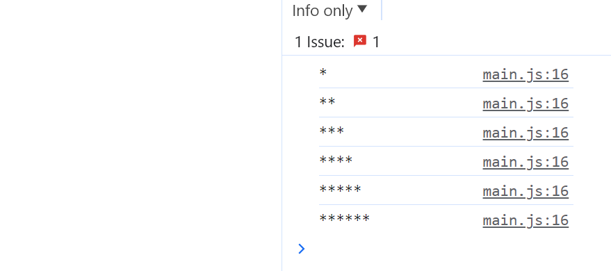

### 7. prompt ашиглан хэрэглэгчээс n гэсэн тоог авч n хүртэлх анхны тоонуудыг console-руу хэвлэж харуул

#### Жишээ нь:

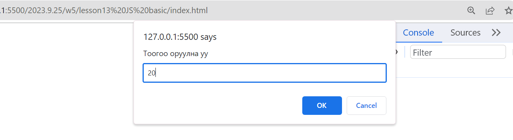
 -->
