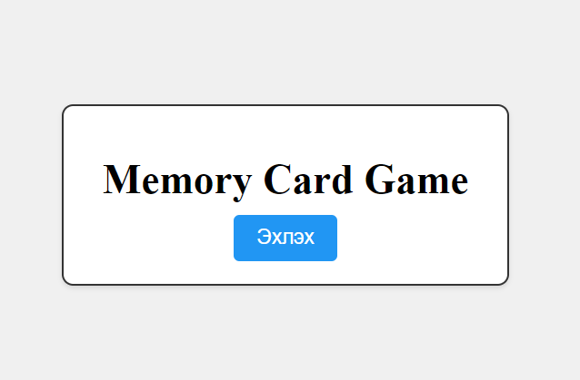
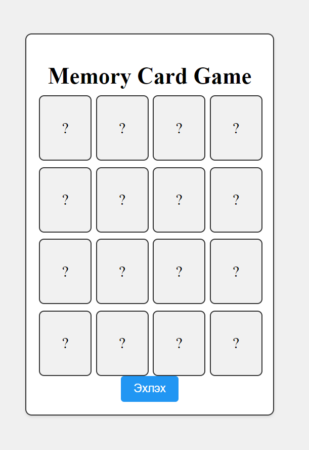
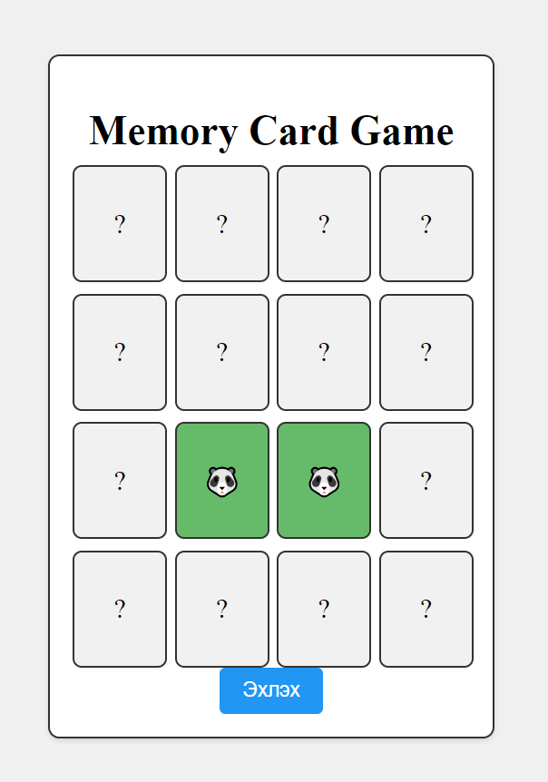
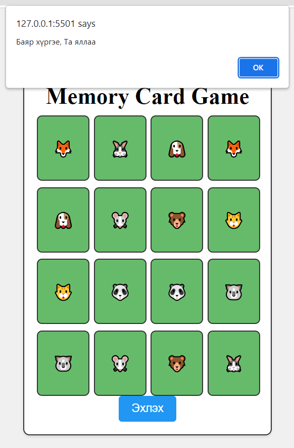

# Хичээл 32: Memory card game

## Тоглоомны танилцуулга
```jsx
 const emojis = ["🐶", "🐱", "🐭", "🐰", "🦊", "🐻", "🐼", "🐨"];
```

  - Эхлэх товч дээр дарж тоглоомыг эхлүүлэх ба картыг 2,2-оор нь нээгээд хоорондоо адилхан таарсан үед карт дэлгээтэй үлдээд, хоорондоо таараагүй тохиолдолд картууд буцаад хаагдана. Бүх карт хоорондоо таараад дэлгэгдэх үед тоглоомонд хожино.
  
  
  
  
