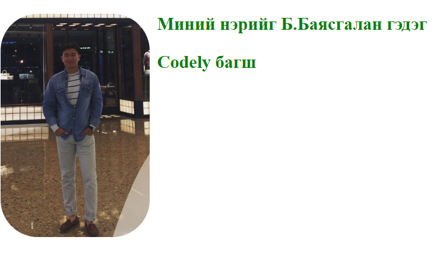

# Хичээл 1: лекц слайд

Environment:

1. Vscode extensions: Live server, Prettier
2. Install git bash
3. Веб зохиомж хавтас үүсгээд vscode дээр нээх

### Slide: https://docs.google.com/presentation/d/1gW2_IRIJiBb33foTqGZB_TQFITSiFy17OZpIRGNTMic/edit?usp=sharing

### Video: https://youtu.be/-AAQxRKrkRc

# Hands-on

### 1. HTML Basics

### 2. CSS Basics

### 3. Formatting Code

### 4. Inspect Page (devtools) - DOM

### 5. Summary

### Links

