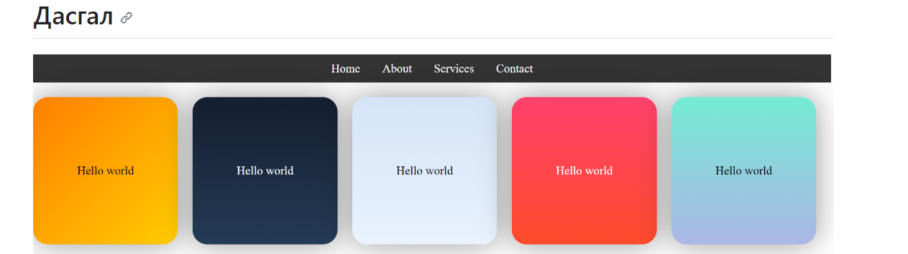

# Хичээл 2:

### [Slide үзэх бол](https://docs.google.com/presentation/d/1VJxdftbpjb6QAfPWy1mN2WJCyvPj67pChdZkv67kXIA/edit?usp=sharing)

# Hands-on

### 1. Heading section: charset, viewport, keywords, description

### 2. Text: h1-6, p, span (b, i, sub,sup,mark)

### 3. Links: target="\_blank", download, image path, page link

### 4. Images: src, alt, width, height

### 5. Audio: src, alt, mute, control

### 6. Video: src, alt, mute, control

### 7. Entities: &copy;, &lt;, &gt;

### 8. CSS intro:
1. External css
2. Selectors: tag, id, class
3. Inspect Page (devtools) - DOM
4. Normalize.css
5. background-color
6. color
7. color hex code
8. gradient
9. width, height
10. text-align
11. padding, margin
12. object-fit
13. text-decoration

  