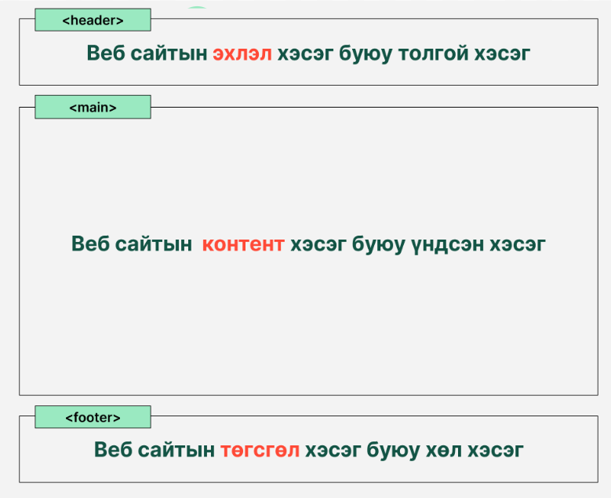
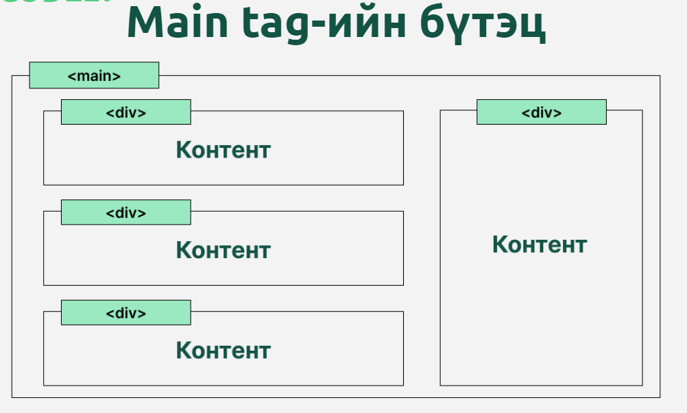
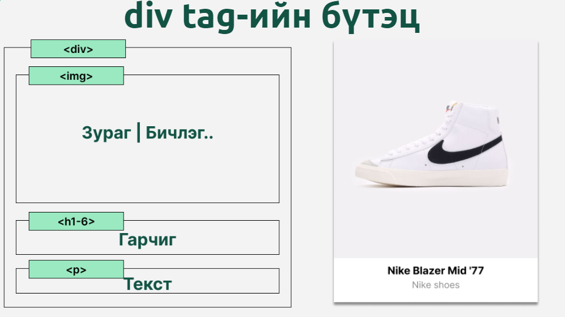
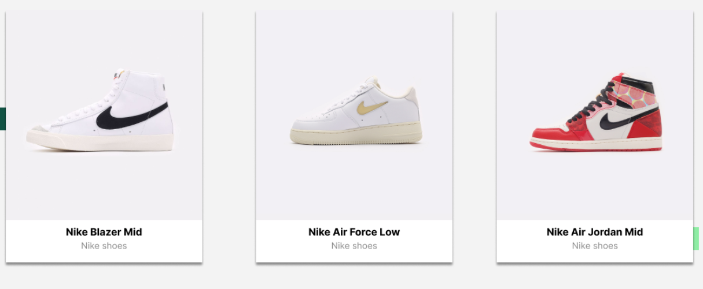

# Хичээл 3:

### Slide: <https://docs.google.com/presentation/d/1fuA7aV8n5q8ni812dD2xIpcjWHZJEMIIos1WGUkXRrU/edit?usp=sharing>

# Hands-on
### CSS intro:

1. Selectors: tag, id, class
2. Flexbox:
- display:flex
- justify-content
- display:flex

### Vscode shortcuts:
- ctrl + s
- ctrl + enter
- ctrl + space
- ctrl + p

# Дасгал ажил:
1. CSS selector: <https://flukeout.github.io/> уг линкээр ороод тоглоомын үеүүдийг даваарай.
2. Flexbox example:

