# Хичээл 08 - Array буюу Массивтай ажиллах нь:

 
 
# Hands-on

## Array буюу Массивтай ажиллах нь:

### 1. Массивт шинэ элемент нэмэх:

- [1,2,3].push(8,9) - массивийн төгсгөлд элемент нэмнэ:
  Үр дүн: [1,2,3,8,9]
  - Жишээ нь:

```sh
let array = [1,2,3];
array.push(8,9); # Хаалтан дотор нэмэх гэж буй элементүүдээ таслалаар тусгаарлан бичнэ.
console.log(array);
# Console дээр: [1,2,3,8,9] гэж харагдах болно.
```

### 2. Массиваас элемент хайх: indexOf, find

#### indexOf:

- [1,2,3].indexOf(3) - массиваас тухайн утгийг хайж байрлалыг буцаана.
  Үр дүн: 2 буюу элементын индексийг буцаана олдоогүй үед -1 буцаана.
  - Жишээ нь:

```sh
let array = [1,2,3];
let index = array.indexOf(3); # Хаалтан дотор хайх гэж буй элементээ бичнэ.
console.log(index)
# Console дээр: 2 буюу 3 гэсэн элементийн индекс харагдах болно.
console.log(array.indexOf(5));
# console.log дотор бас бичиж өгч болно. Энэ тохиолдолд console дээр: 5 гэдэг элементийг хайгаад олдохгүй тул -1 гэж харагдана.
```

#### find:

- [1,2,3,4,5].find(element=>{
  return element === 4
  })
  Үр дүн: 4 => indexOf дээр тухайн элементийн индексийг гаргаж байсан бол find ашиглан тухайн элементийг харуулна.
- Жишээ 1:

```sh
let array = [1,2,3];
let element = array.find(element=>{ return element==3})
console.log(element)
# Console дээр: 3 буюу 3 гэсэн элементийг харуулах болно.
console.log(array.find(element=>{ return element==3}))
# console.log дотор бас бичиж өгч болно.
```

- Жишээ 2: "lessons" буюу хичээлүүдийн дүнгийн мэдээлэл агуулсан массиваас "Англи хэлний" хичээл хайх:

```sh
const lessons = [
{name:'Математик',point: 100},
{name:'Англи хэл',point: 90},
{name:'Монгол хэл',point: 95}
]
const english = lessons.find(element=> element.name ==='Англи хэл')
# object-оос бүтсэн элементийн хувьд object-ийн дотор байгаа зүйлсээр хайж болдог. Элемент олдсон үед элементийг бүхлээр нь харуулна.
console.log(english);
# Console дээр: {name:'Англи хэл',point: 90} гэж элемент бүхлээрээ харагдана.
```

### 3. Массиваас элемент устгах:

#### Бүх элементийг устгах:

- array.length = 0 буюу массивын уртыг 0 болгосноор массивыг хоослоно
- Жишээ нь:

```sh
const numbers = [1,2,3,4];
numbers.length = 0
console.log(numbers)
# Console дээр: хоосон array буюу [] гэж харагдах болно.
```

#### Хэсэгчлэн устгах:

- array.splice(startIndex, deleteCount):
  - startIndex - Эхлэх индексийг заана
  - deleteCount - startIndex -с эхлэн хэдэн элемент устгахыг заана
- Жишээ нь:

```sh
const numbers = [1,2,3,4];
numbers.splice(1, 2) # 1 индекстэй элементээс эхлэн 2 элемент устгана.
console.log(numbers)
# Console дээр: үлдсэн элементүүд буюу [1,4] гэж харагдана.
```

#### Хамгийн сүүлд байгаа 1 элементийг устгах:

- array.pop() -> Array-н сүүлийн элементийг устгах
  [1,2,3,4].pop() => [1,2,3]
- Жишээ нь:

```sh
const numbers = [1,2,3,4];
numbers.pop() # Хамгийн сүүлийн элемент буюу 4 гэсэн элементийг устгана.
console.log(numbers)
# Console дээр: үлдсэн элементүүд буюу [1,2,3] гэж харагдана.
```

### 4. Массив элементүүдийг хуваах:

- slice: Массивын элементүүдээс индексээр нь хэсэгчилэн шинэ массив үүсгэх.
  [1,2,3,4,5,6,7,8].slice(2,5) => [3,4,5] буюу 2 дах индексээс эхлэн индекс 5дахь индекс хүртэл (5 дах индекс өөрөө орохгүй) элементүүдээр шинэ массив үүсгэнэ.
- Жишээ нь:

```sh
let numbers = [1,2,3,4,5,6,7,8]
let minNumbers = numbers.slice(0,4) # 0 индекстэй элементээс эхлээд 4 индекстэй элемент хүртэл хувааж аваад minNumbers гэсэн array-т хадгалж байна. (4 индекстэй элемент өөрөө орохгүй)
console.log(minNumbers) # Хувааж авсан элементүүдээс үүссэн шинэ array буюу [1,2,3,4] гэж харагдана.
console.log(numbers) # Анхны array өөрчлөгдөхгүйгээр [1,2,3,4,5,6,7,8] хэвээрээ байна.
```

### 5. Массивын элементүүдийг нэгтгэх:

- spread operator буюу элементүүдийг тараан байршуулах:
- Жишээ нь:

```sh
   const numbers1 = [1,2,3,4]
   const numbers2 = [5,6,7,8]
   const numbers = [...numbers1, ...numbers2] # ... нь numbers1 болон numbers2-ийн элементүүдийг тарааж тавьж байна.
   console.log(numbers) # numbers1, numbers2-ийн элементүүдийн нэгдэл буюу [1,2,3,4,5,6,7,8] гэж харагдана.
   console.log(numbers1) # [1,2,3,4] гэж харагдах ба numbers1 болон numbers2 нь өөрчлөгдөхгүй хэвээрээ байна.
```

### 6. Массив элементүүдийг array => string (join), string => array (split) руу хувиргах

#### join:

- [1,2,3].join('-') - массив дахь бүх элементүүдийг нэгтгэн string үүсгэнэ.
  Үр дүн: 1-2-3

#### split:

- "Hello world".split(' ') - string текст-г салгаж массив болгоно. Энэ тохиолдолд ' ' буюу хоосон зайгаар текстийг салгаж массив болгосон байна.
  Үр дүн: ['Hello','world']

- "Hello world".split(' ').join('-')
  Үр дүн: Hello-world

- Жишээ нь:

```sh
let string = "Hello world"
let array = string.split(" ") # string-ийг хоосон зайгаар нь салгаж 2 элементтэй array үүсгэж байна. split(" ") хашилтан дотор хоосон зай авсанаар хоосон зай устаж "Hello", "world" гэсэн 2 элемент үүсч байна.
console.log(array) # ["Hello", "world"] гэж харагдана.
let string2 = array.join("-") # array-н элементүүдээ "-" ээр холбон string үүсгэж байна.
console.log(string2) # "Hello-world" гэж харагдана.
```

# Дасгал ажил:

### 1. "apple,orange,kiwi" -> ["apple","orange","kiwi"]

- prompt ашиглан жимсний нэрнүүд авч fruits хувьсагчид оноож
- fruits-г split ашиглан array болгон хувиргаж
- console -руу харуулаарай. 

#### Жишээ нь:

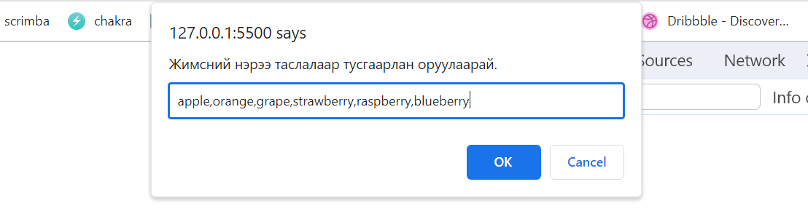
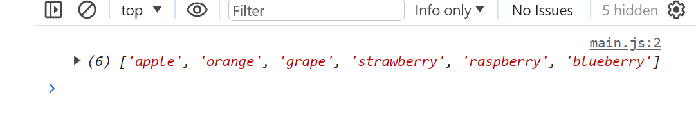

### 2. "apple,orange,kiwi" -> ["apple","orange","kiwi","banana"]

- prompt ашиглан жимсний нэрнүүд авч fruits хувьсагчид онооно. String төрөлтэй байгаа
- fruits-г split ашиглан array болгон хувиргаж.
- "banana" -г fruits-руу нэмээд 
- console-руу хэвлэн харуулаарай

#### Жишээ нь:


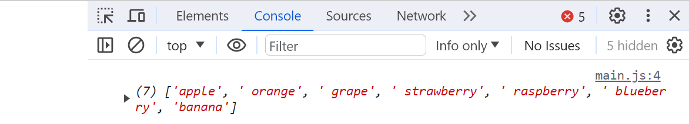

### 3. [] => [1,2,3]
- "numbers" нэртэй хоосон массив үүсгэ. 
- push аргыг ашиглан массив дээр 1, 2, 3 тоог нэмж
- Үр дүнгээ console.log ашиглан харуулаарай.

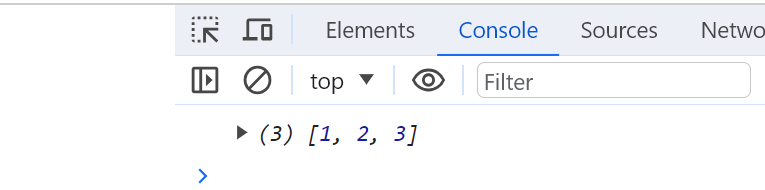

### 4. indexOf('nomin')
prompt ашиглан нэрнүүд аваад split ашиглан "name" нэртэй массив үүсгэ. indexOf аргыг ашиглан "nomin" элементийн индексийг олж alert ашиглан харуулаарай.

#### Жишээ нь:

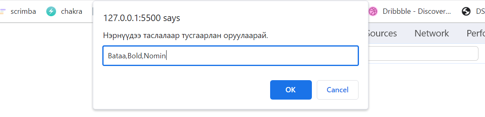


### 5. prompt ашиглан хүний насыг илэрхийлэх тоонууд өгөөд "age" нэртэй массив үүсгэ. "indexOf" аргыг ашиглан массив дотор 40 гэсэн утга массиваас олдоогүй үед "Ийм утга байхгүй", олдсон үед "Ийм утга байна" гэж alert ашиглан дэлгэцэнд харуулаарай.

#### Жишээ нь:
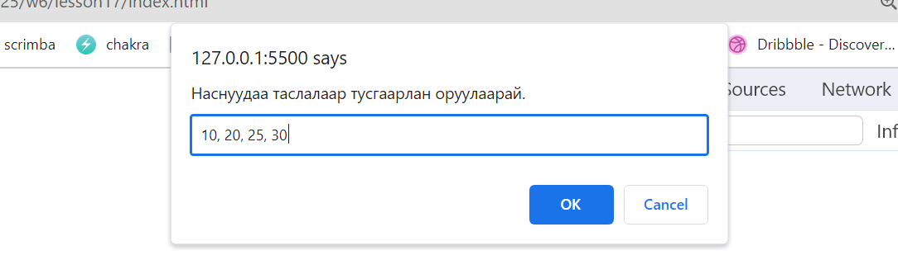
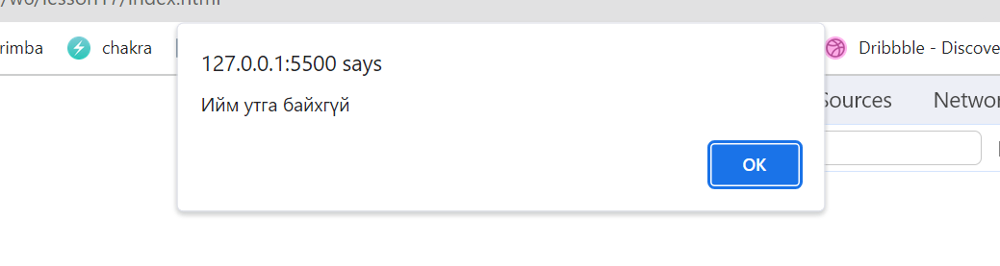

### 6. prompt ашиглан нэрнүүд өнгөнүүд аван "colors" нэртэй массив үүсгэ. "pop" аргыг ашиглан массиваас сүүлчийн элементийг устган үр дүнгээ alert ашиглан харуулна уу.

#### Жишээ нь:

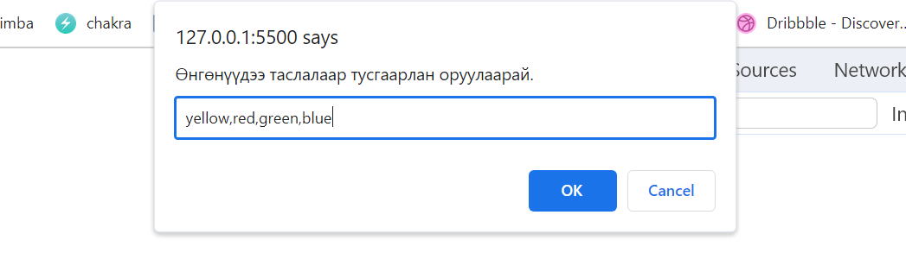
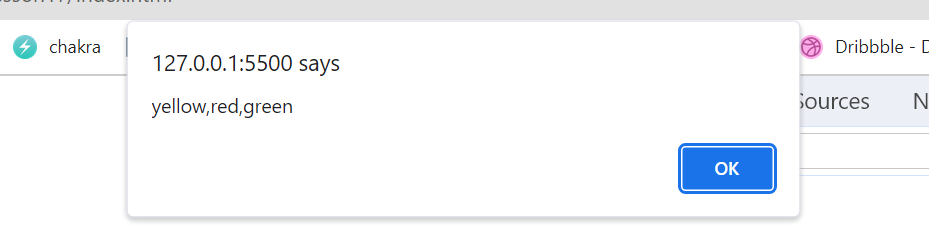

### 7. prompt ашиглан нэрнүүд амьтны нэр аван "animals" нэртэй массив үүсгэ. "splice" аргыг ашиглан массиваас эхний 2 элементийг устган үр дүнгээ alert ашиглан харуулна уу.

#### Жишээ нь:

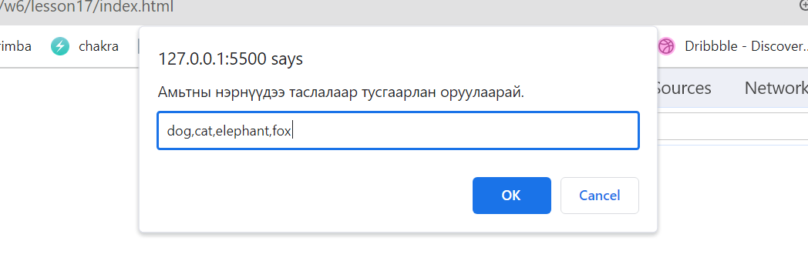
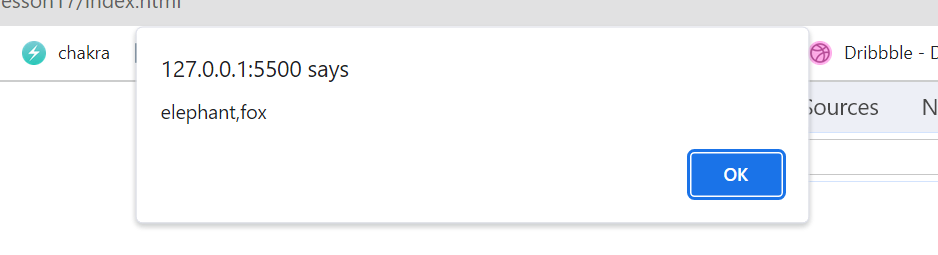

### 8. [1,2,3,4] бүхий "numbers" нэртэй массив үүсгэ. Массивыг "splice" ашиглан хоослоод үр дүнгээ console.log ашиглан харуулаарай

#### Жишээ нь:

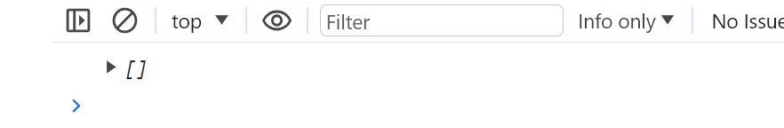

### 9. [1,2,3,4] бүхий "numbers" нэртэй массив үүсгэ. Массивыг хоослохын тулд массивын уртыг 0 болгож тохируулна уу. Үр дүнгээ console.log ашиглан харуулаарай.

#### Жишээ нь:


### 10. "Алим", "гадил", "жүрж", "усан үзэм", "киви" гэсэн элементүүдээр "fruit" нэртэй массив үүсгэ. slice аргыг ашиглан зөвхөн "гадил", "жүрж", "усан үзэм" гэсэн элементүүдийг агуулсан "slicedFruits" нэртэй шинэ массив үүсгэн үр дүнгээ console.log ашиглан харуулаарай.

### 11. [1, 2, 3] бүхий "numbers" нэртэй массив үүсгэ. "numbers"-ын элементүүдийг 4-ийн тооны хамт агуулсан "newNumbers" нэртэй шинэ массивыг spread operator (...) ашиглан үүсгэн үр дүнгээ console.log ашиглан харуул.

### 12. prompt ашиглан дурын утгыг авч "firstArray" болон "secondArray" гэсэн хоёр массив үүсгэ. spread operator (...) ашиглан хоёр массивыг шинэ массив болгон нэгтгэн үр дүнгээ alert ашиглан харуул.

#### Жишээ нь:

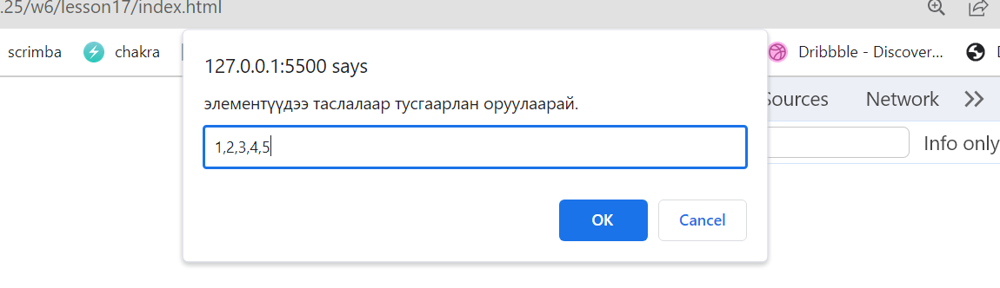
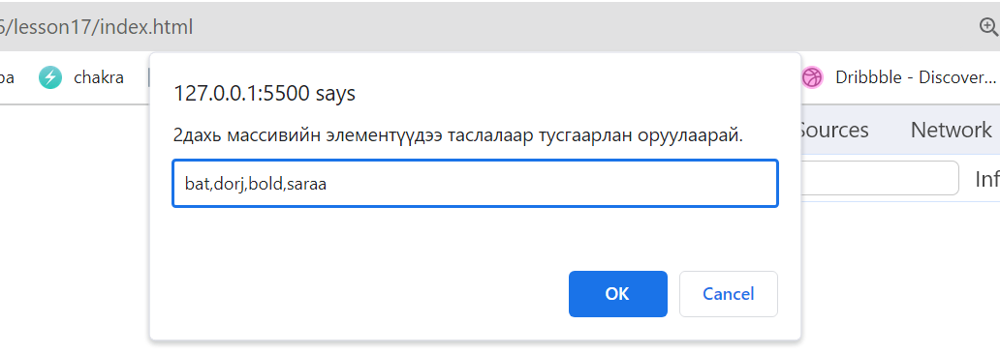
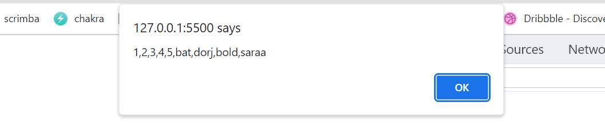
