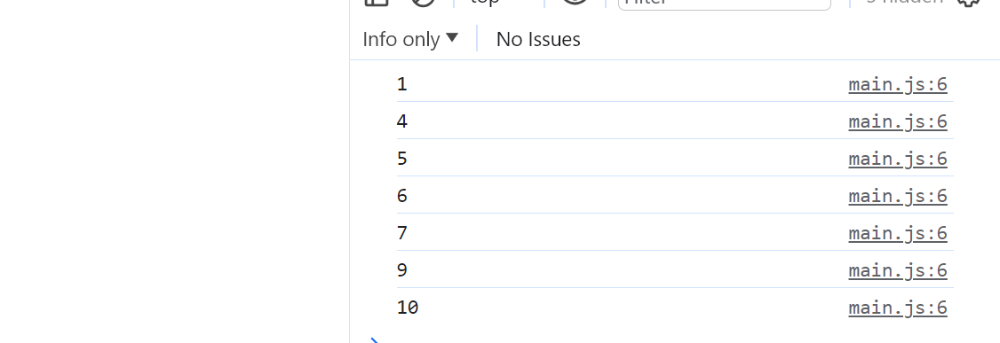

# Хичээл 08 - 2: For давталт ашиглан массивтай ажиллах нь

<!-- ### Лекц бичлэг:

### Бодлого бичлэг:  -->
 
### For давталт ашиглан массивийн элементүүдэд хандах:

- Массивийн элемент бүрээр нь давтаад тэдгээр дээр ямар нэг өөрчлөлт оруулах боломжийг өгдөг.
- Жишээ нь:

```sh
const cars = ["Toyota", "Honda", "Ford", "Chevrolet", "BMW", "Mercedes-Benz"];
for (let i = 0; i < cars.length; i++) { #cars.length гэдэг нь cars хүснэгтийн урт буюу нийт хэдэн элементтэйг тодорхойлох ба энэ давталт cars хүснэгт дуустал ажиллана гэсэн үг.
    cars[i] += "-Car" # Toyota-Car гэх мэтээр харагдуулахын тулд cars хүснэгтийн элемент бүр дээр -Car гэсэн текстийг залгаж байна.
    console.log(cars[i]); # Өөрчлөгдсөн элементүүдээ console-руу хэвлэж байна.
}
```

# Дасгал ажил:

### 1. Массив давталт
prompt ашиглан numbers нэртэй хувьсагчид тоон утгууд оруулж элементүүдийг тус тусад нь console.log ашиглан хэвлэж харуулаарай.




### 2. 3-д хуваагддаг тоонууд 
prompt ашиглан numbers нэртэй хувьсагчид тоон утгууд авч 3-д хуваагддаг элементүүдийг нэгтгэж alert ашиглан харуулаарай. 3-т хуваагдах ганц ч элемент байхгүй байвал "3-т хуваагддаг элемент алга" гэж харуулна.

- Жишээ1:
  
  
- Жишээ 2:
  
  

### 3. 3 болон 5-д хуваагддаггүй тоонууд
prompt ашиглан numbers хүснэгт авч 3 эсвэл 5-д хуваагддаг элементүүдээс бусдыг нь 1 alert ашиглан харуулаарай.


### 4. Цагаан толгойн байрлал олох
prompt ашиглан 1 үг авч тухайн үгний үсэгнүүд цагаан толгойн хэддэх үсэгнүүд болохыг alert ашиглан харуулаарай.


### 5. Сурагчдийн дүнг хайгч
Дараах students дата өгөгдсөн байна. prompt ашиглан A,B,C,D,F гэсэн дүнгээс сонгон оруулахад тухайн дүнтэй сурагчдийн нэрийг хамтад нь alert ашиглан харуулаарай.

```sh
const students = [
  { name: "Alice", point: 90 },
  { name: "Bob", point: 55 },
  { name: "Charlie", point: 78 },
  { name: "David", point: 22 },
  { name: "Eve", point: 68 },
  { name: "Frank", point: 36 },
  { name: "Grace", point: 95 },
  { name: "Hannah", point: 89 },
  { name: "Ivy", point: 83 },
  { name: "Jack", point: 41 },
  { name: "Katie", point: 87 },
  { name: "Liam", point: 84 },
  { name: "Mia", point: 79 },
  { name: "Noah", point: 93 },
  { name: "Olivia", point: 86 },
  { name: "Peter", point: 57 },
  { name: "Quinn", point: 94 },
  { name: "Ryan", point: 80 },
  { name: "Sophia", point: 75 },
  { name: "Tyler", point: 46 }
];
```


### 6. Хичээлдээ унасан болон унаагүй сурагчид.
Дээрхи бодлогоны өгөгдөл дээр prompt ашиглан "unasan" эсвэл "unaagui" гэсэн утгыг авч хичээлдээ унасан эсвэл унаагүй хүүхдүүдийн нэрийг хамтад нь alert ашиглан харуулаарай. unasan, unaagui-ээс өөр утга байвал мэдээллээ дахин оруулнуу гэж харуулаарай.


