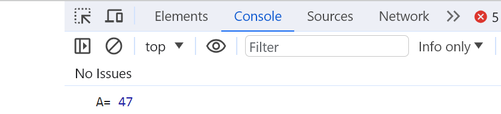

# Хичээл 08 - 3: Функц

JavaScript функц нь дахин хэрэглэх боломжтой тодорхой үйлдлийг гүйцэтгэхэд зориулагдсан багц кодууд юм.
 
### Функцийг зарлах (тодорхойлж өгөх) 
```sh
const greeting = () => {
  console.log('Hello function');
} 
```
### Функцийг ажиллуулах
```sh
greeting();
# Үр дүнд нь 'Hello function' гэж console-руу хэвлэнэ.
```

### 1. Гаднаас параметр дамжуулдаг функц

```sh
# Дугуй хаалтан дотор байгаа x, y нь энэ функцийн параметр болно.
const sum = (x,y) =>{   
  # функц-д return үйлдэл байхгүй бол үр дүн буцаахгүй.
 return x + y;  
}
# Бичсэн функцаа ашиглахдаа параметруудын оронд утга өгч ашиглана
sum(3,2) 
# Үр дүн: 5
sum(3)
# Үр дүн: NaN буюу 3 + undefined
sum(3,2,5,4)
# Үр дүн: 5 буюу эхний 2 утгийг аваад бусдыг ашиглахгүй
```

- Жишээ нь:
  
  
  
  

### 2. Анхны утгатай параметр


### 3. Local vs Global scope: Хамрах хүрээ

```sh
let globalVariable = 'энэ бол глобал хувьсагч';

const myFunction = () => {
    let localVariable = 'энэ бол локал хувьсагч';
    console.log(localVariable); // Output: энэ бол локал хувьсагч
    console.log(globalVariable); // Output: энэ бол глобал хувьсагч
}
console.log(globalVariable); // Output: энэ бол глобал хувьсагч
console.log(localVariable); // Error: localVariable is not defined
```

# Дасгал ажил:

### 1. Өгөгдсөн илэрхийллийн утгыг олдог "calculate" нэртэй функц бич. A=B\*C-D ( B, C, D утгийг гараас авна)

- Илэрхийллийн бичиглэлийг өөрчлөхгүйгээр зөвхөн B,C,D-н утгыг өөрчлөхөд илэрхийллийн хариу үнэн байхаар хийнэ. Хариугаа console.log ашиглан шалгаарай.
- 
- 

### 2. Гараас хоног, цаг өгсөн бол нийт цаг болохыг олдог "totalTime" нэртэй функц бичээрэй.

- day буюу хоног, time буюу цаг өгсөн 2 хувьсагч байх ба нийт хэдэн цаг байгааг тооцон totalTime хувьсагчид хадгалан console.log ашиглан харуулаарай.
- 
- 

### 3. Гараас өгсөн 2 тооны ихийг олж буцаадаг "max" нэртэй функц бич

- 
- 

### 4. Тэгш өнцөгтийн урт өргөнийг авч талбайг нь олдог calculateArea нэртэй функц бич.

- 
- 


### 5. Өгсөн онооны үсгэн үнэлгээг олдог "checkPoint" нэртэй функц бич

      - 90 : 'A'
      - 80 - 89: 'B'
      - 70 - 79: 'C'
      - 60 - 69: 'D'
      - < 60 : 'F'
      функц дээрхийн дагуу console руу хэвлэх ёстой.

- 
- 


### 6. Массив авч массив доторхи хамгийн их элементийг олдог findLargestElement нэртэй функц бич.

- 
- 

### 7. Массив авч элементүүдийг тонгоргож бичдэг reverseArray нэртэй функц бич.

- 
- 

### Нэмэлт: Массив авч өгөгдсөн элементүүдийг багаас их рүү нь эрэмбэлдэг sortArray нэртэй функц бич.

- 
- 
