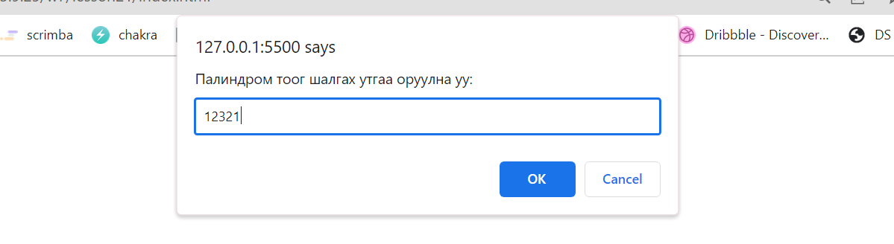
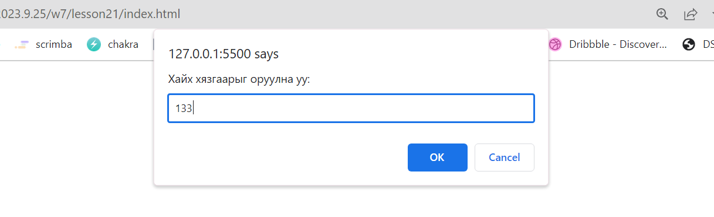
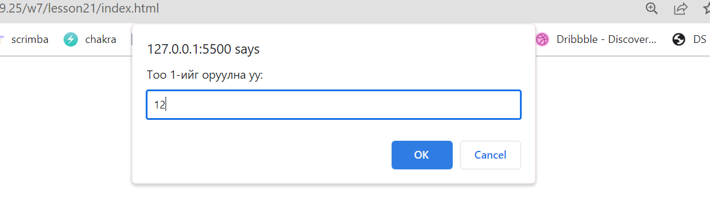
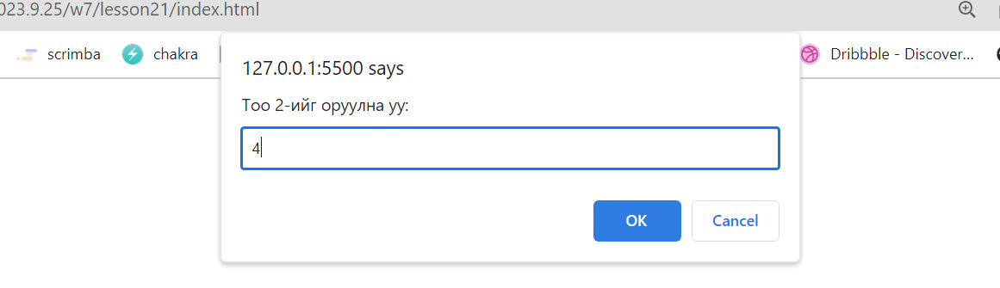
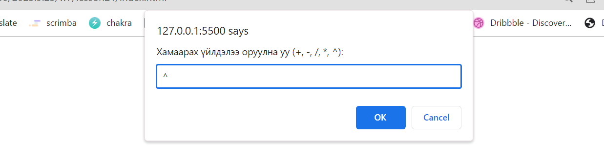
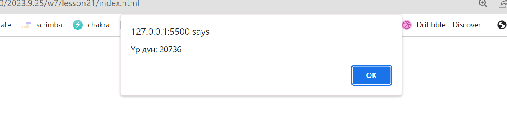

# Хичээл 08-4: Функц давтах

JavaScript функц нь дахин хэрэглэх боломжтой тодорхой үйлдлийг гүйцэтгэхэд зориулагдсан багц кодууд юм.

### 1. Палиндром тоо:

- Өгөгдсөн тоог палиндром тоо мөн эсэхийг шалгадаг функц бичээрэй. Функцээ prompt ашиглан утга авч alert ашиглан харуулж шалгаарай. `const isPalindrome = (number) => {}`

  - (Палиндром тоо гэдэг нь ардаасаа урдаасаа ижил уншигддаг тоог хэлнэ.)
    
    

### 2. Өгсөн тоо хүртэлх палиндром тоо:

- Дасгал 1 дээр хэрэгжүүлсэн функцээ ашиглан өгөгдсөн тоо хүртэл бүх палиндром тоог 1 массивт хийн alert ашиглан харуулдаг функц бичээрэй. Утгаа prompt ашиглах авна. `const allPalindrome = () => {}`
  
  

### 3. 2 тоог нэмэх

- 2 тоог хооронд нь нэмдэг функц бичээрэй. `const add = (a,n) => {} `
  - Үр дүнгээ console.log ашиглан шалгаарай.
    - Оролт: add(67, 90)
    - Гаралт: 157

### 4. 2 тоог хасах

- 2 тоог хооронд нь хасдаг функц бичээрэй. `const minus = (a,n) => {} `
  - Үр дүнгээ console.log ашиглан шалгаарай.
    - Оролт: minus(140, 99)
    - Гаралт: 41

### 5. 2 тоог үржих

- 2 тоог хооронд нь үрждэг функц бичээрэй. `const multiply = (a,n) => {} `
  - Үр дүнгээ console.log ашиглан шалгаарай.
    - Оролт: multiply(11, 12)
    - Гаралт: 132

### 6. 2 тоог хуваах

- 2 тоог хооронд нь хуваадаг функц бичээрэй. `const divide = (a,n) => {} `
  - Үр дүнгээ console.log ашиглан шалгаарай.
    - Оролт: divide(100, 8)
    - Гаралт: 12.5

### 7. зэргийг олох

- an -ийг олдог функц бичээрэй. `const degree = (a,n) => {}`
  - Үр дүнгээ console.log ашиглан шалгаарай.
    - Оролт: degree(2, 10)
    - Гаралт: 1024

### 8. Тооны машин:

- Дээрхи 5 функцээ ашиглан тооны машины функц хийгээрэй ингэхдээ 3 удаа prompt ашиглан 1-р тоо, 2-р тоо, тэмдэг аван
  - тэмдэг '+' байвал 2тоог нэмээд,
  - тэмдэг '-' байвал 2 тоог хасаад,
  - тэмдэг '/' байвал 2 тоог хуваагаад,
  - тэмдэг '\*' байвал 2 тоог үржээд,
  - тэмдэг '^' байвал зэргийг олоод
    үр дүнгээ alert ашиглан харуулна. Эдгээрээс бусад тохиолдолд 'аль нэг утга буруу байна' гэж харуулаад функцийг дахин эхлүүлнэ.
    
    
    
    
