# Хичээл 10-1: React

  
## React гэж юу вэ?

- React нь JavaSript хэлэнд суурилсан user interface (UI) буюу хэрэглэгчийн харж, хэрэглэж буй тухайн нүүрэн хэсгийг зурах зорилготой гарсан сан (library) юм. 2013 онд хуучнаар Фэйсбүүк буюу Мета компань хөгжүүлэн гаргасан ба гарсан цагаасаа хөгжүүлэгчдийн дунд сенсац болж хөгжүүлэлтийн чиг хандлагийг өөрчилөн дараагийн шатанд гаргасан бүтээл болсон билээ. Өөрөөр хэлбэл фэйсбүүк компаний мэргэжлийн багийнхан таны хийж буй UI-г хамгийн хурдан, харилцан ажиллагаатай байхаар зохиомжлон гаргасан ба бид бүхэн тухайн асуудлийг react-д даатгаж веб үндсэн логик болон дэлгэцийн ажиллагаа дээр анхаарна гэсэн үг юм.
### React сурснаар:
  - Веб сайт
  - Гар утасны апп
  - Windows Desktop апп гэх мэт бүхий л төрлийн UI зурах боломжтой

### React ашигладаг компаниуд

  - 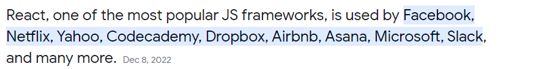

### USA-д react хөгжүүлэгчийн эрэлт болон цалин

  - 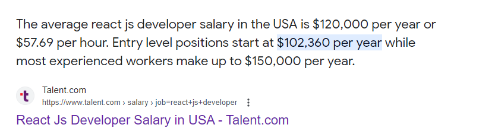
  - 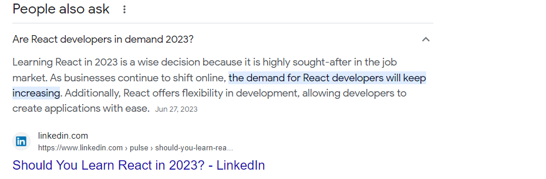

### [2023 онд ч гэсэн Javascript-ийн тренд, чиг хандлагийг React тэргүүлсээр байна](https://trends.google.com/trends/explore?cat=31&q=Vue%20jobs,React%20jobs,Angular%20jobs)

  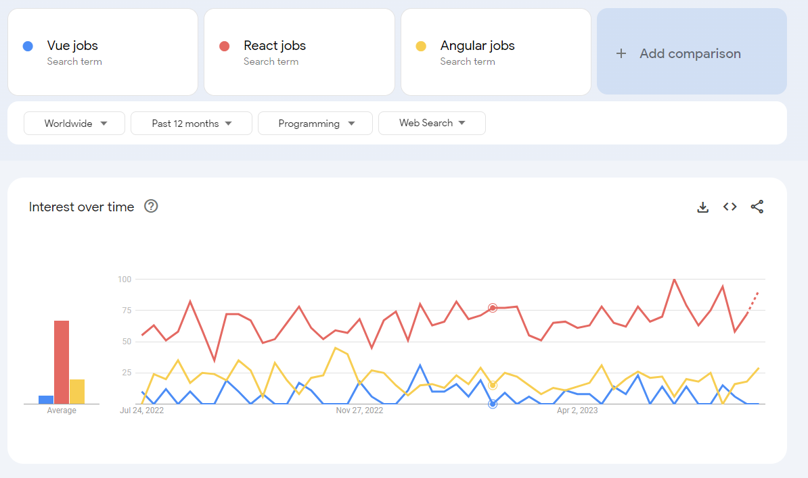

### React апп-ийн хамгийн гол цөм болсон ойлголт нь компонент юм

  - Компонент нь энгийнээр дэлгэцний жижиг бүрэлдэхүүн хэсэг гэж ойлгож болно. Нөгөө талаас бидний хийж буй дэлгэц нь маш олон жижиг хэсгүүдээс бүтдэг гэсэн үг. Тиймээс React хөгжүүлэгчид дахин ашиглах боломжтой, нэгнээсээ хамааралгүй компонентуудыг тус тусад нь хөгжүүлж тухайн хэсгүүдээ ашиглаж бүрэн дэлгэц бүтээдэг гэсэн үг.
  - 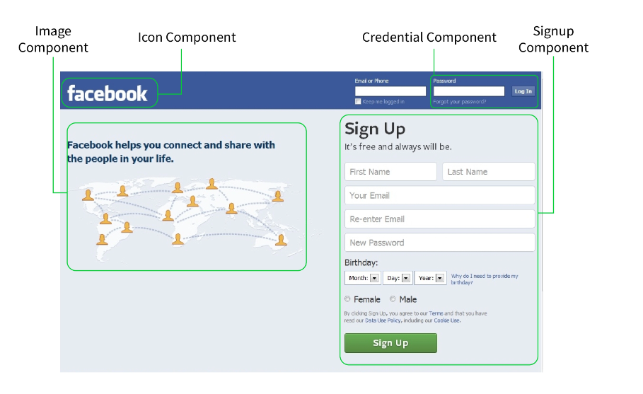
  - 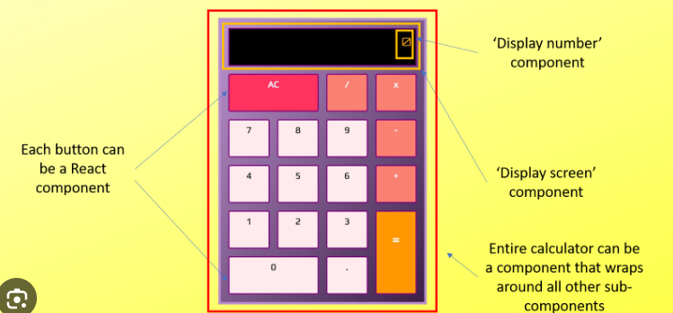

### React апп нь дор хаяж 1 компоненттой байх бөгөөд тухайн компонент нь бусад дэлгэцэнд шаардлагатай бүх компонентүүдийг дотроо агуулна

  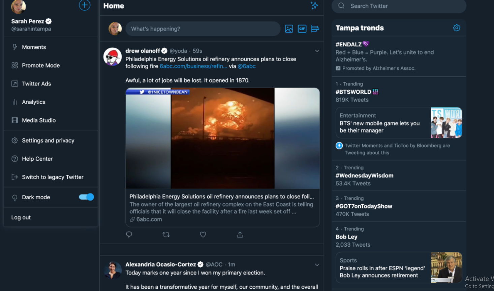
  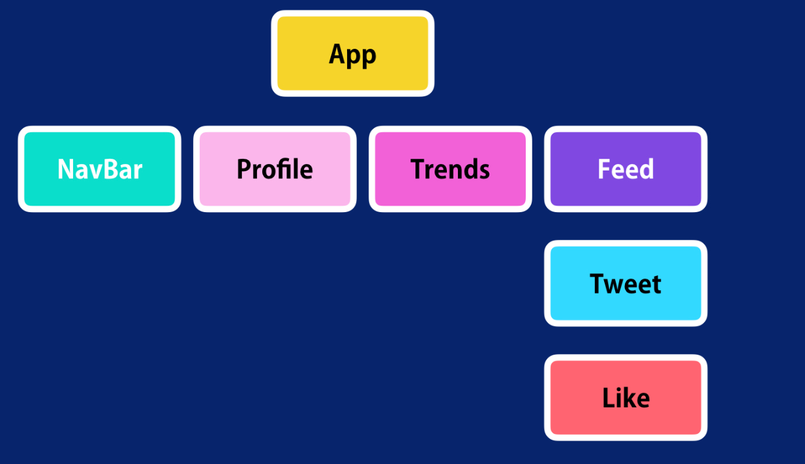

- React компонент-г хэрхэн бичдэг вэ?:

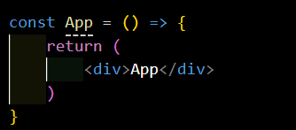


### MyComponent нэртэй компонент үүсгэж үзье: 
- Компонент нь функцтэй адил бичигдэнэ. 
- Компонентын нэр болон файлын нэр нь үргэлж том үсгээр бичигдэнэ. 
```js
// react санг оруулж ашиглахад бэлдэнэ
import React from "react";
const MyComponent = () => {
  // return дотор бичсэн html нь дэлгэцэнд харагдана 
  return <div>Hello World</div>;
};
// MyComponent -г export хийж өөр файл дотор хэрэглэх боломж өгнө 
export default MyComponent
```

### Компонент дуудаж ашиглах болон анхаарах зүйлс:

- Дуудахдаа: <MyComponent/> буюу  html tag -тай адил <Компонент нэр /> гэж бичигдэнэ
- Компонент-г ашиглахын тулд import хийсэн байх шаардлагатай.
```js
// Компонент-г байгаа хавцаснаас нь import хийж байна.
import MyComponent from './components/MyComponent';
function App() {
  return (
    <div>
    // Компонент-г дуудаж ашигласан байдал
      <MyComponent />
    </div>
  );
}
export default App;

```

## Props: Компонент-руу props буюу гаднаас утга дамжуулан ашиглах боломжтой

```js
// компонент-г харуулахдаа props-р утга дамжуулж байна
  <div>
       <MyComponent text="Миний анхны компонент"/>
  </div>
```

```js
// MyComponent.js
import React from "react";
// Дамжуулсан утга нь text хувьсагчаар орж ирж ашиглагдана.
const MyComponent = ({text}) => {
  return <div>{text}</div>;
};
```

## React хөгжүүлэлтийн орчинг бэлдэцгээе.

1. Node.js татаж суулгах: https://nodejs.org/en. Node.js нь npm буюу өөрийн package manager тэй хамт суудаг. npm -г ашиглан бид 3 дагч нэмэлт сангууд суулгаж ашиглах боломжтой.
2. Vscode -руу ороод View -> Terminal цэсийг сонгож terminal нээнэ.
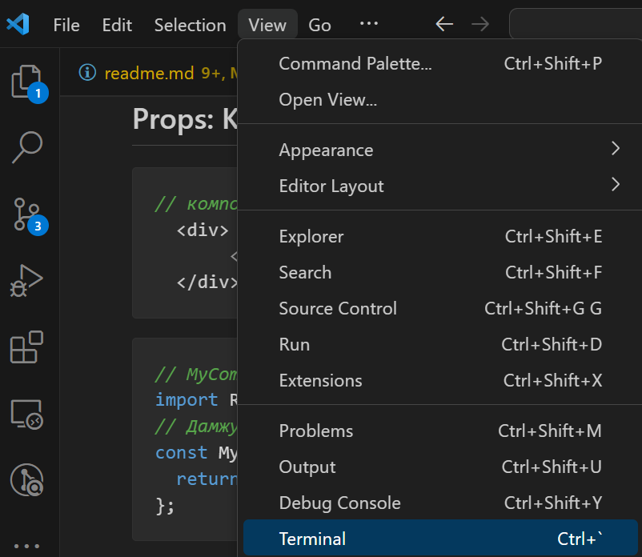

3. Terminal дээр амжилттай суусан эсэхийг шалгах:
```sh
node -v 
```
- 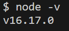
4. Терминал дээр доорхи команд уншуулан "create-react-app" програм суулгах. Энэ React апп үүсгэх зориулалттай програм юм.

```sh
npm install -g create-react-app
```

5. Vscode дээр React-д зориулсан нэмэлт extension суулгах:

- ES7+ React/Redux/React-Native snippets

6. Vscode дээр React tag тохиргоо хийх:
- Хэрэглэгчийн тохиргооны файл нээнэ: ctrl+shift+p товч дарж "Open user settings (JSON)" гэж бичээд enter дарна
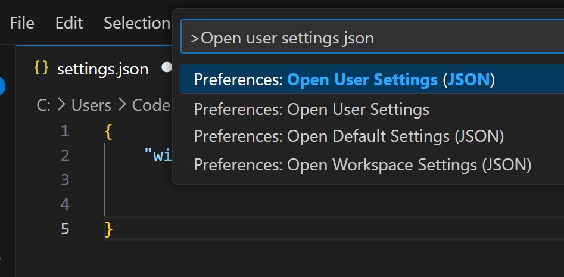
- settings.json файл нээгдэх бөгөөд тухайн файл дотор дараах кодыг хуулж тавиад хадгална
```sh
"emmet.includeLanguages": {
     "javascript": "javascriptreact"
 },
 "emmet.syntaxProfiles": {
     "javascript": "jsx"
 }
```

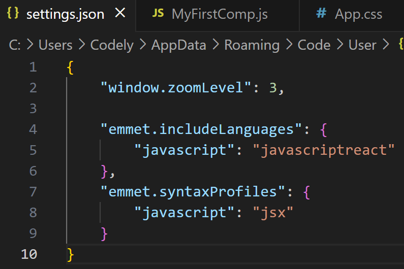


## Анхны React апп үүсгэх

- Терминал дээр доорхи команд уншуулан "my-first-react" нэртэй React апп үүсгэх:

```sh
npx create-react-app my-first-react
```

- Терминал дээр доорхи cd буюу хавцас хооронд шилжих команд ашиглан үүсгэсэн React апп -руу орох ажиллуулах:
```sh
cd my-first-react
```
- Шинэ үүсгэсэн React апп-аа vscode дээр нээх:
```sh
code my-first-react
```
- Дараах бүтэцтэй олон файл үүссэн байх бөгөөд бидний гол кодоо бичих анхаарч ажиллах хавцас бол "src" юм. Бусад файлуудыг түр алгасаж болно оо.
```sh
my-app/
  README.md
  node_modules/
  package.json
  public/
    index.html
    favicon.ico
  src/
    App.css
    App.js
    App.test.js
    index.css
    index.js
    logo.svg
```

- Тухайн хавцас дотор шилжсэний дараа React Апп-г асааж ажиллуулах. Нэг удаа асаасан бол дахин асаахгүй. (Бидний мэдэх live server -тай ижил зорилготой)
```sh
npm start
```

#### Ажиллаж байгаа веб сайтаа шалгах хаяг: <http://localhost:3000/>

# Дасгал ажил:

1. Дараах алхамын дагуу "Box" нэртэй хамгийн анхны компонент үүсгэж үзнэ үү.
- src хавцас дотор components нэртэй хавцас үүсгэнэ.
- Box.js нэртэй файл үүсгэх. Нэр нь том үсгээх эхлэх ёстой.
- 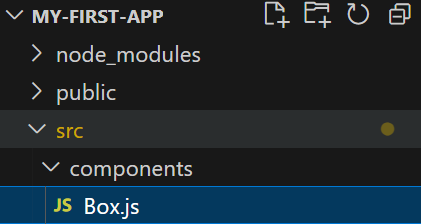
- Box.js дотор "rafce" түлхүүр үг ашиглан компонентийн код үүсгэх. Түлхүүр үгээр үүсгэж болохгүй бол өмнөх хичээл дээрхи "ES7+ React/Redux/React-Native snippets" extension-г суулгасан эсэхээ шалгаарай.
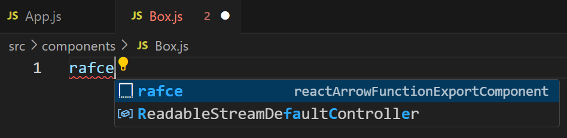
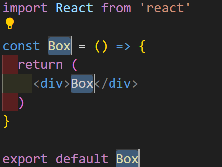
2. Box.js компонент-г App.js дотор дуудаж харуулах
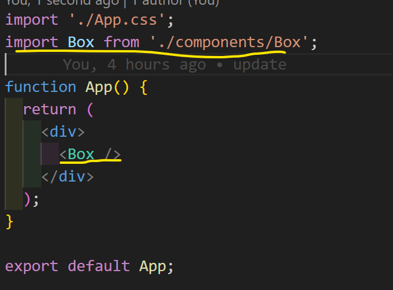
3. Box.js компонент дээр класс ашиглан дараах стайлыг бичиж харуулна уу. CSS-г App.css дээр бичнэ:
- Өндөр: 100px
- Өргөн: 100px
- Арын өнгө: Gold
4. Box.js компонент-г App.js дотор дуудаж ашиглана уу.
- 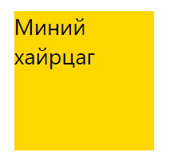
5. App.js дотор Box.js компонент-г 3 удаа дуудаж харуулах ба дараах байдлаар харагдах ёстой. 
- text нэртэй props ашиглан  доторхи текст-г дамжуулж өгнө.
- 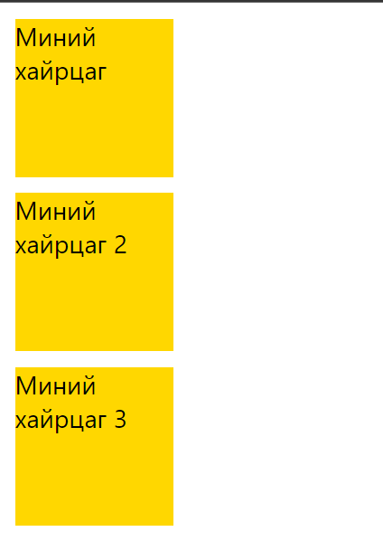
 
<!-- 


1. Доорхи жишээг кодыг ашиглан nike-н пүүзны мэдээллийг харуулдаг Sneaker нэртэй компонент хийгээрэй. (CSS нэмж бичнэ)

- Жишээ нь:

  - 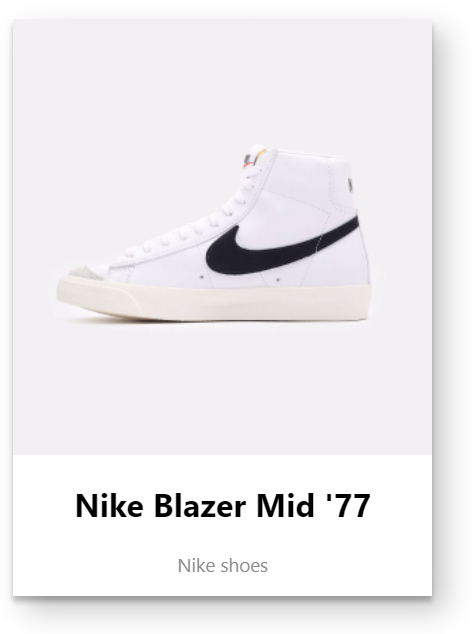
  - Жишээ код:

  ```js
  const Sneaker = ({ imageUrl, header, description }) => {
    return (
      <div className="product-card">
        
        <div className="product-details">
          <h2 className="product-header">{header}</h2>
          <p className="product-description">{description}</p>
        </div>
      </div>
    );
  };
  ```

  - App.js:

  ```js
  import React from "react";
  import Sneaker from "./Sneaker";
  import image1 from "./images/image1.png";

  const App = () => {
    return (
      <div className="App">
        <h1>Your React App</h1>
        <Sneaker
          imageUrl={image1}
          header="Nike Blazer Mid '77"
          description="Nike shoes"
        />
      </div>
    );
  };

  export default App;
  ```


2. Өмнө нь хийсэн Sneaker компонент-г ашиглан доорхи датагаар пүүзний жагсаалт харуулаарай.
```
- name: "Nike Blazer Mid '77", description: 'Classic sneakers with a vintage look.'
- name: 'Nike Air Max 270', description: 'Air Max series with a comfortable and stylish design.'
- name: 'Nike React Element 55', description: 'Modern design with React technology for a comfortable feel.'
- name: 'Nike Zoom Pegasus Turbo 2', description: 'Lightweight and responsive running shoes.'
- name: 'Nike Air Force 1', description: 'Timeless style and versatility.'
- name: 'Nike Joyride Run Flyknit', description: 'Innovative cushioning for a smooth and comfortable run.'

``` -->
 <!-- - id: 7, header: 'Nike Free RN 5.0', description: 'Lightweight and flexible shoes for natural movement.' -->
 <!-- - id: 8, header: 'Nike Air Zoom Pegasus 36', description: 'Versatile running shoes with responsive cushioning.' -->
 <!-- - id: 9, header: 'Nike Renew Run', description: 'Soft foam cushioning for a smooth and comfortable run.' -->
 <!-- - id: 10, header: 'Nike React Infinity Run Flyknit', description: 'Stability and cushioning for a comfortable and supported run.' -->
 <!-- - id: 11, header: 'Nike Air Max 97', description: 'Iconic design with full-length Air Max cushioning.' -->
 <!-- - id: 12, header: 'Nike Air Zoom Structure 23', description: 'Stability and support for your running needs.' -->
 <!-- - id: 13, header: 'Nike React Vision', description: 'Bold design with React foam for all-day comfort.' -->
 <!-- - id: 14, header: 'Nike SB Dunk Low', description: 'Skateboarding shoes with iconic Dunk style.' -->
 <!-- - id: 15, header: 'Nike Air Vapormax Flyknit 3', description: 'Revolutionary cushioning with a futuristic design.' -->
 <!-- - id: 16, header: 'Nike Zoom Freak 2', description: 'Basketball shoes with responsive Zoom Air cushioning.' -->
 <!-- - id: 17, header: 'Nike Waffle Racer', description: 'Vintage-inspired shoes with a classic Waffle sole.' -->
 <!-- - id: 18, header: 'Nike Air Huarache', description: 'Timeless design with a comfortable and supportive fit.' -->
 <!-- - id: 19, header: 'Nike Revolution 5', description: 'Versatile running shoes with soft foam cushioning.' -->
 <!-- - id: 20, header: 'Nike Phantom Venom Elite FG', description: 'Soccer cleats with precision and power for elite players.' -->
 
<!-- 2. Үүсгэсэн object array-аараа map давталт ашиглан Products компонент үүсгээрэй -->
<!-- 3. Products компонентоо App компонент дотроо ашиглаарай. -->

<!-- - Эцэстээ дараах байдлаар харагдах хэрэгтэй
  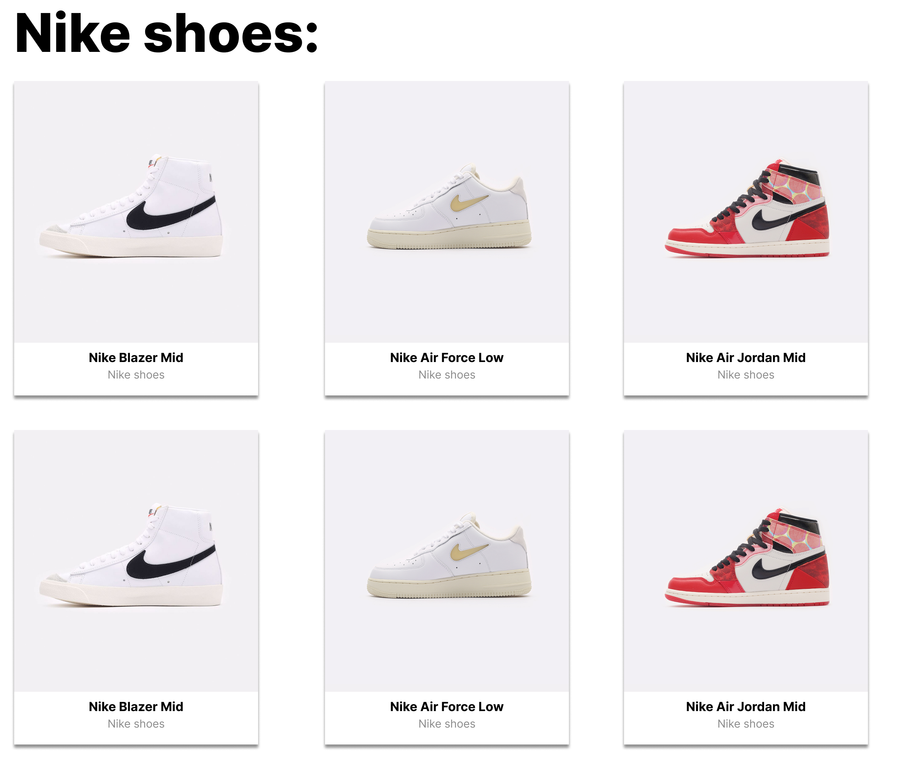 -->
