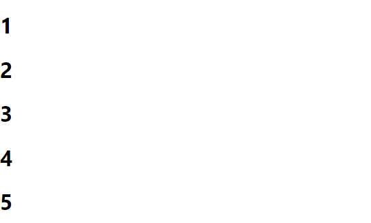
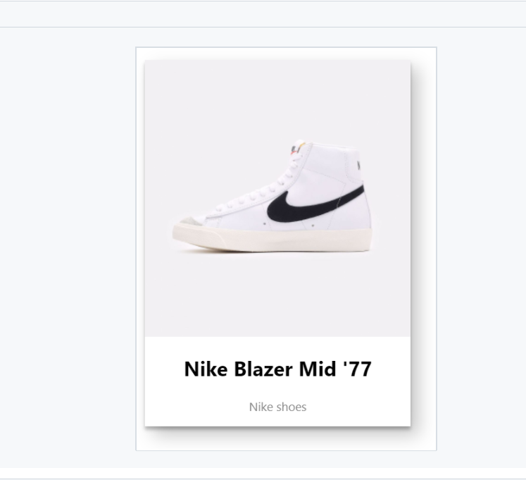
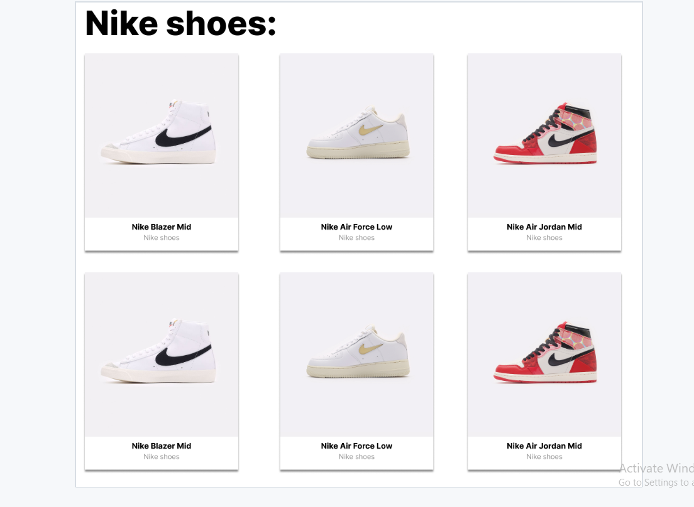

# Хичээл 10-2: React component давтлага

<!-- ### Бататгах тест kahoot: 

- [Kahoot тест өгөх](<https://kahoot.it/challenge/02799103?challenge-id=52e8dc11-25fb-4f0e-bbb7-bfe2b8499817_1700555535227>) -->

## Массив дээр "map" давталт хийх
- React дээр массив элементүүдийг ашиглаж дэлгэцэнд харуулах үед түгээмэл хэрэглэнэ
- Массив доторхи элемент бүрээр давтана.
```js
import React from "react";
const MyComponent = () => {
  const numbers = [1,2,3,4,5]
  // numbers дотор байгаа элемент бүрийг дэлгэцэнд
  // h1 таг ашиглан харуулж байна. 
  return <div>
       {numbers.map(number=> <h1>{number}</h1>)}
  </div>;
};
```
### Дээрхи давталт нь дараах бичиглэлтэй ижил үр дүн харуулна.
```sh
<h1>1</h1>
<h1>2</h1>
<h1>3</h1>
<h1>4</h1>
<h1>5</h1>
```



# Дасгал ажил:

1. Доорхи жишээг кодыг ашиглан nike-н пүүзны мэдээллийг харуулдаг Sneaker нэртэй компонент хийгээрэй. (CSS нэмж бичнэ)

- Жишээ нь:

  - 
  - Жишээ код:

  ```js
  const Sneaker = ({ imageUrl, header, description }) => {
    return (
      <div className="product-card">
        
        <div className="product-details">
          <h2 className="product-header">{header}</h2>
          <p className="product-description">{description}</p>
        </div>
      </div>
    );
  };
  ```

  - App.js:

  ```js
  import React from "react";
  import Sneaker from "./Sneaker";
  import image1 from "./images/image1.png";

  const App = () => {
    return (
      <div className="App">
        <h1>Your React App</h1>
        <Sneaker
          imageUrl={image1}
          header="Nike Blazer Mid '77"
          description="Nike shoes"
        />
      </div>
    );
  };

  export default App;
  ```
2. Өмнө нь хийсэн Sneaker компонент-г ашиглан доорхи датагаар пүүзний жагсаалт харуулаарай.
 
- id:'1', name: "Nike Blazer Mid '77", description: 'Classic sneakers with a vintage look.'
- id:'2', name: 'Nike Air Max 270', description: 'Air Max series with a comfortable and stylish design.'
- id:'3', name: 'Nike React Element 55', description: 'Modern design with React technology for a comfortable feel.'
- id:'4', name: 'Nike Zoom Pegasus Turbo 2', description: 'Lightweight and responsive running shoes.'
- id:'5', name: 'Nike Air Force 1', description: 'Timeless style and versatility.'
- id:'6', name: 'Nike Joyride Run Flyknit', description: 'Innovative cushioning for a smooth and comfortable run.'
2. Үүсгэсэн object array-аараа map давталт ашиглан Products компонент үүсгээрэй
3. Products компонентоо App компонент дотроо ашиглаарай.

- Эцэстээ дараах байдлаар харагдах хэрэгтэй
 

  
