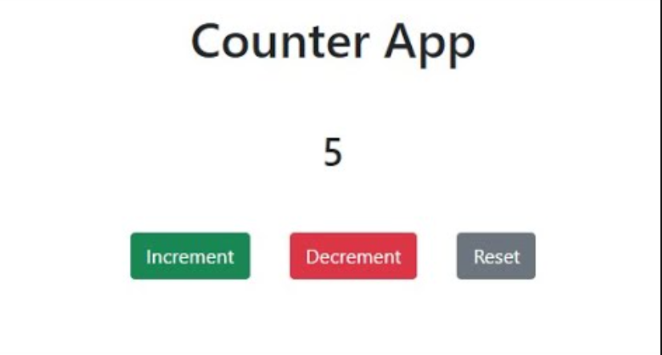
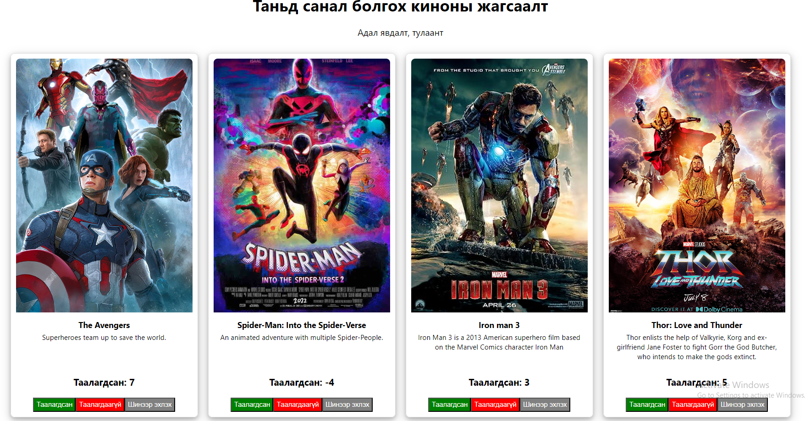

# Lesson 12-1 - State буюу компонентийн төлвийн тухай

React дээрхи **state** гэх ойлголт нь харилцан үйлдэлтэй орчин үеийн веб болон мобайл апп хийхэд туслах гол зүйл юм.

## State гэж юу вэ?

Энэ нь компонентийн төлвийг илтгэдэг нэг төрлийн онцгой хувьсагч юм. Энэ нь компонент дотор дэлгэцэнд өөрчлөгдөн харагдах шаардлагатай утгуудийг хадгалах бөгөөд тухайн утгуудыг өөрчлөх үед дэлгэц шинэчлэгдэж харагддаг.
## Яагаад чухал вэ?

- **Динамик UI:** Жишээ нь та вебийн хайлт хийдэг хэсэгт текст бичээд тухайн текстийн дагуу хайсан үр дүн чинь шууд харагдуулахын тулд стэйт хэрэг болно.
- **Data Handling:** Таны апп-д дэлгэцэнд харуулах хэрэгтэй байгаа датаг хадгална.
- **Component Memory:** Компонент дотор хийгдэж буй логик үйлдэлд хэрэгтэй утгуудийг санана.

## State яаж ашиглах вэ?

### 1. Import `useState` Hook

Эхлээд ашиглахын тулд useState функцыг react-с доор харагдаж байгаа шиг оруулж ирнэ.

```jsx
import React, { useState } from 'react';
```

### 2. State зарлах

```jsx
const [count, setCount] = useState(0);
// const count = 0;
setCount(5)
```

`useState` функцыг ашиглан доорхитай адил зарлана. 
- count: Стэйтийн нэр
- setCount: count стэйт-г утгийг өөрчилөхөд хэрэглэх функц
- useState(0): Стэйтийг зарлаад анхны утга 0 гэж зааж байна.   


### 3. State шинэчлэх

```jsx
<button onClick={() => setCount(count + 1)}>Increase Count</button>
```

count state-г setCount функцын тусламжтай 1-р нэмэгдүүлж байна. 
- button onClick гэдэг нь тухайн товчийг дарах үед дотор нь бичсэн setCount(count+1) функцыг ажиллуулна.
- Товч дарах үед count -ийн утга 1-р нэмэгдэж компонент дахин зурагдана. 


### Бүтэн жишээ:
```jsx
import React, { useState } from 'react';

const Counter = () => {
  // Declare state with initial value 0
  const [count, setCount] = useState(0);

  return (
    <div>
      <p>Count: {count}</p>
      <button onClick={() => setCount(count + 1)}>Increase Count</button>
    </div>
  );
};

export default Counter;

```


### Даалгавар

1. Жишээн дээрхи Counter компонент дээр доорхи 2 товчийг нэмээрэй:
- Decrement - Тоог 1-р багасгах 
- Reset - Тоог 0 болгох

   
 
2. Movie компонент дээр Counter компонент-г ашиглан дараах байдлаар тухайн киног таалагдсан эсэхийг харуулаарай.


3. ToggleButton нэртэй дарах үед ON, OFF болж өнгө нь өөрчлөгддөг компонент бич.
- 
- 