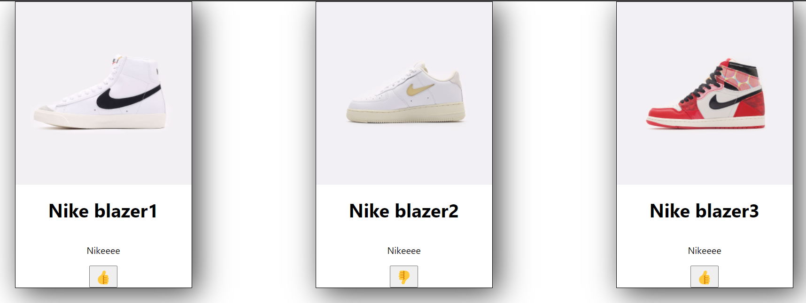
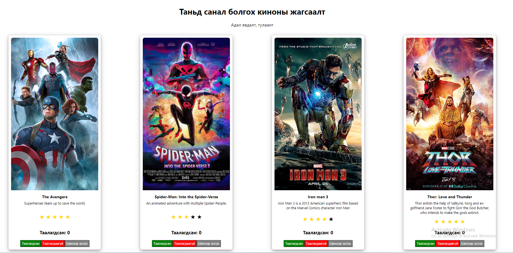

# Хичээл 12-2: React component, state, давтлага

## Conditional rendering: Нөхцөлтэй харуулах
```jsx
 true ? 'on' : 'off'
```

#### Дараах компонентийг  conditional rendering ашиглан бичиж үзье.
ToggleButton нэртэй дарах үед ON, OFF болж өнгө нь өөрчлөгддөг компонент бич.

- 
- 

## Пүүзний жагсаалт дээр үнэлгээ өгдөг болгох.

 
- 
# Дасгал ажил
1. Кинонд одоор үнэлгээ өгдөг болгох.
