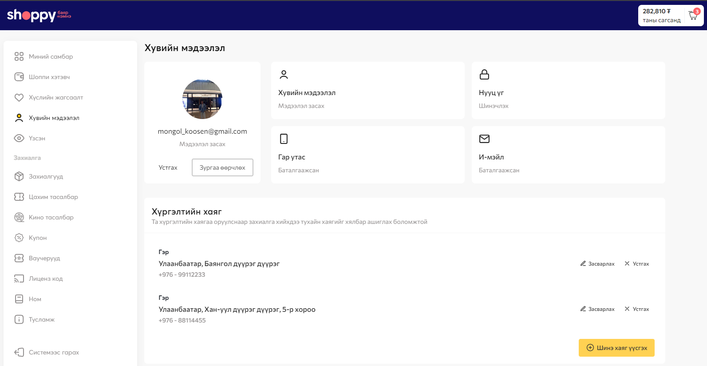
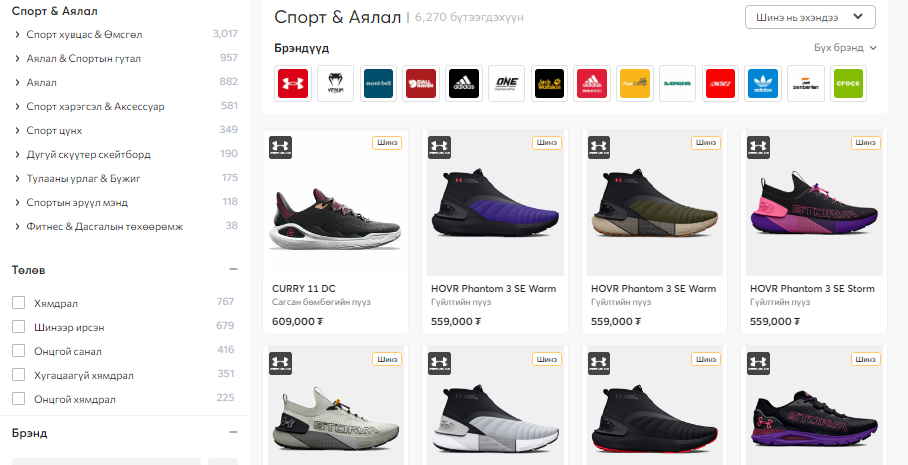
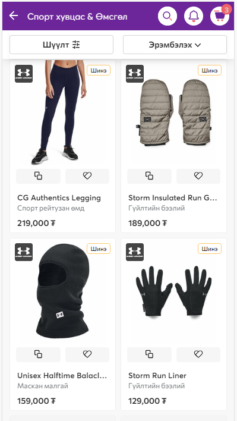
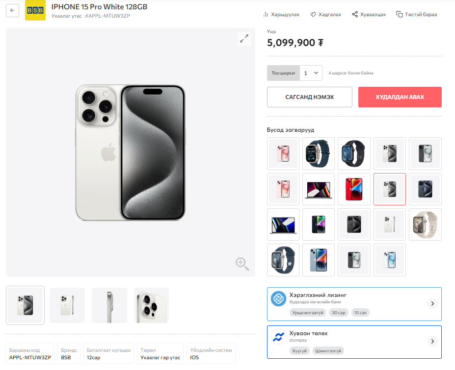
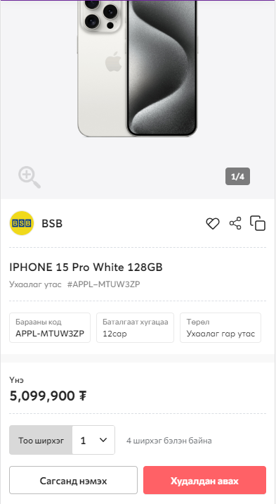

# Явцын шалгалт 1: 2023.10.26
## Заавар
1. Дараах 3 дэлгэцийг хувиарлалтын дагуу flexbox ашиглан хийж гүйцэтгэнэ.
2. Боломжит оноо: 25 
- Similarity: 12 
- Responsive: 8
- Effects (transition, transform): 5
3. Хугацаа: 80 минут

## Дэлгэц 1
### Веб дээр харагдах байдал

### Гар утсан дээр харагдах байдал

## Дэлгэц 2

### Гар утсан дээр харагдах байдал

## Дэлгэц 3

### Гар утсан дээр харагдах байдал
