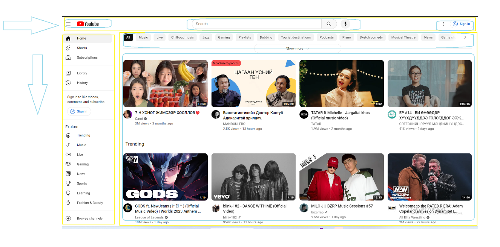

# Хичээл 5:
 
# Hands-on

### 1. flex-box

# Дасгал ажил:

### 1. Дараах зураг дээр байгаа facebook дэлгэцийн үндсэн хуваалтыг дуртай хэрэгслээ ашиглаж хийнэ. /Цаас, Windows paint, Фигма гэх мэт/

### 2. Дараах жишээн дээрхи шиг хуваалтын дагуу тус хэсэг дээр ямар стайл ашигласанг тайлбарлан бичээрэй.

### 3. Хуваалтаа ашиглан дээрхи дэлгэцийн кодыг бичиж зураарай.

### 4. Хийсэн Youtube болон Facebook дэлгэцээ өөрсдийн танилцуулга вэб сайтад миний хийсэн зүйлс гэсэн цэс үүсгэн нэмээрэй.

    - Tip:
            - example хавтсанд байгаа жишээг ашиглаарай.
            - бичсэн кодоо хадгалсан эсэхээ шалгаарай.
            - head хэсэгт css файлаа холбосон эсэхээ шалгаарай.
            - асуулт гарж ирвэл багшийгаа дуудаарай. 😉
 