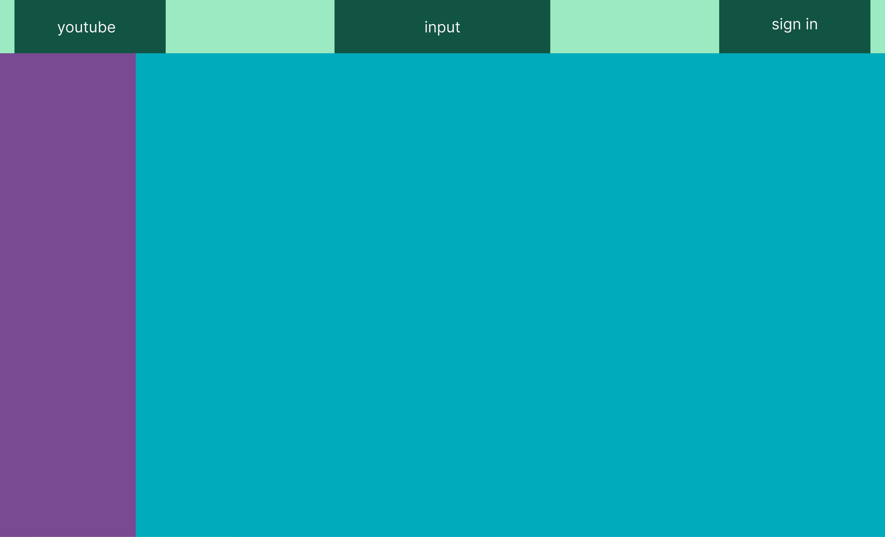
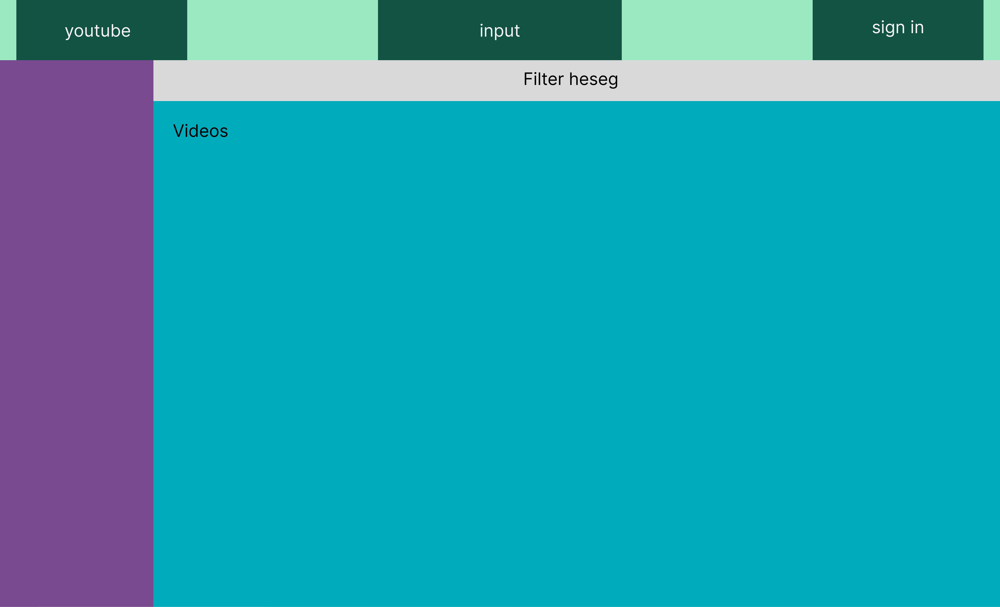
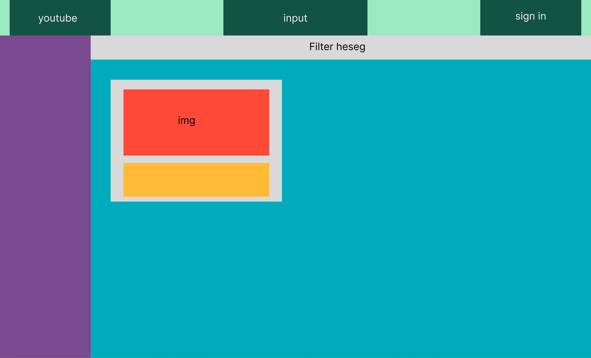
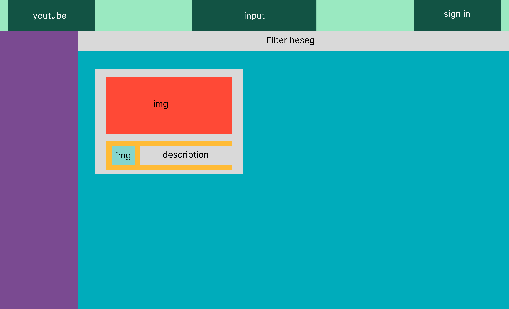
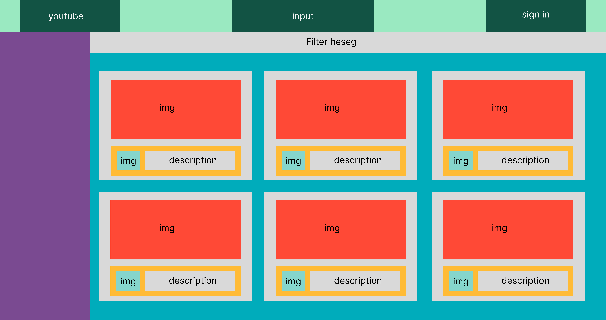

# Хичээл 5:

# Hands-on

### 1. flex-box

# Дасгал ажил:

### Youtube нүүр хуудсыг лекц дээр үзүүлсэний дагуу кодыг нь бичиж үзэх.

### Step 1:

Дэлгэцийн хамгийн том хуваалтыг хийнэ.

### Step 2:

Толгой хэсэгт харагдах элементүүдийг хэвтээ (row) чиглэлд байрлуулна.

### Step 3:

Үндсэн контент харагдах хэсгийг filter, videos хэсэгт хувааж доош нь чиглэлтэй өрнө.

### Step 4:

Videos хэсэгт тухайн 1 бичлэгийг дүрслэх доош чиглэлтэй div үүсгэнэ.

### Step 5:

Тухайн бичлэгний элементүүдийг байрлуулна. img, h1, p ...

### Step 6:

1 бичлэгний кодыг 6 ширхэг хуулж тавина. Энд 1 бичлэгний өргөн 30% буюу 1 мөрөнд 3 ширхэг багтах хэмжээтэй бөгөөд, 4 дөх бичлэгнээс дараагийн мөрөнд шилжих (flex-wrap:wrap) ёстой.

