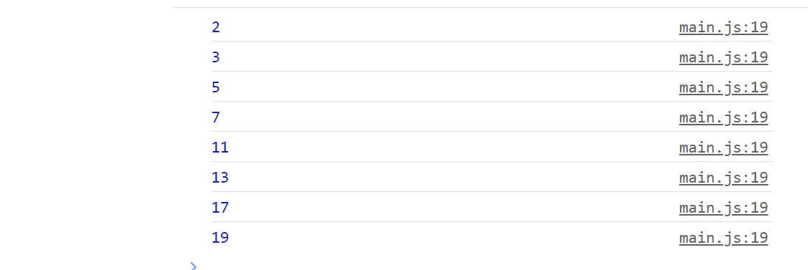

# Хичээл 07 - 3:

### Өмнөх 7 хоногийн бататгах тест: https://kahoot.it/ пассийг багш хэлнэ.

# Hands-on

### for loop:

#### continue; - Давталтыг тухайн алхамыг алгасаж дараагийн алхамд шилжүүлнэ. Жишээ: давталт дотор i -н утга 2 үед алгасна
```sh
for(let i=0; i <= 3; i++)
 if(i === 2)
 continue;
 console.log(i);
```

#### break; - Давталтыг шууд дуусгана. Жишээ: давталт дотор i -н утга 2 үед лавталт шууд дуусна.
```sh 
for(let i=0; i <= 3; i++)
 if(i === 2)
 break;
 console.log(i);
```
 

# Дасгал ажил:

### 1. For давталт ашиглан n тоо хүртэлх тоог console -руу хэвлэнэ. Гэхдээ 3-т хуваагддаг тоог хэвлэхгүй алгасана хэрэгтэй.

Жишээ нь: n=10 үед 
1,2,4,5,7,8,10 -г хэвлэнэ.

### 2. For давталт ашиглан тооны факториалыг олох програм бич.  Факториал нь тухайн тооноос 1 хүртэл бүх тоонуудын үржвэр юм.
Жишээ нь: 5-ийн факториал: 5\*4\*3\*2\*1 
### 3. prompt ашиглан хэрэглэгчээс n гэсэн тоог авч 1-с n хүртэл \*-ийг дараах байдлаар console-руу хэвлээрэй.

#### Жишээ нь:


### 4. prompt ашиглан хэрэглэгчээс n гэсэн тоог авч n хүртэлх анхны тоонуудыг console-руу хэвлэж харуул

#### Жишээ нь:


 
