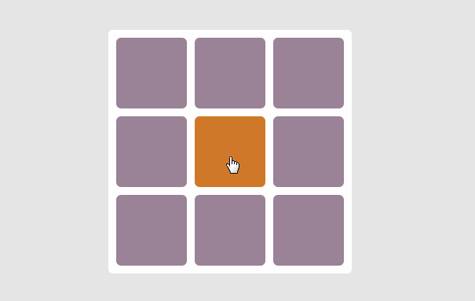

# React дасгал ажил

1. Хөгжилтэй хоч: Тэмдэг нэр, Нэр үгнүүдээс санамсаргүй байдлаар холбож хоч үүсгэх:

- Math.floor(Math.random() * adjectives.length)

<!-- 1. Tic tac буюу X O тоглоом:
  - 

2. Сохор болзоо: Эрэгтэй эмэгтэй хосуудын зураг оруулж болзоонд явуулах -->

<!-- import React, { useState } from 'react';

const FunnyNameGenerator = () => {
  const adjectives = ['Silly', 'Funny', 'Wacky', 'Crazy', 'Giggly'];
  const nouns = ['Monkey', 'Banana', 'Penguin', 'Pizza', 'Bubblegum'];

  const [funnyName, setFunnyName] = useState('');

  const generateFunnyName = () => {
    const adjective = adjectives[Math.floor(Math.random() * adjectives.length)];
    const noun = nouns[Math.floor(Math.random() * nouns.length)];
    setFunnyName(`${adjective} ${noun}`);
  };

  return (
    

      <h2>Funny Name Generator</h2>
      
Your funny name is: {funnyName}

      <button onClick={generateFunnyName}>Generate Funny Name</button>
    

  );
};

export default FunnyNameGenerator;