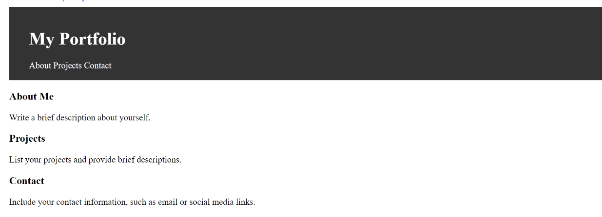
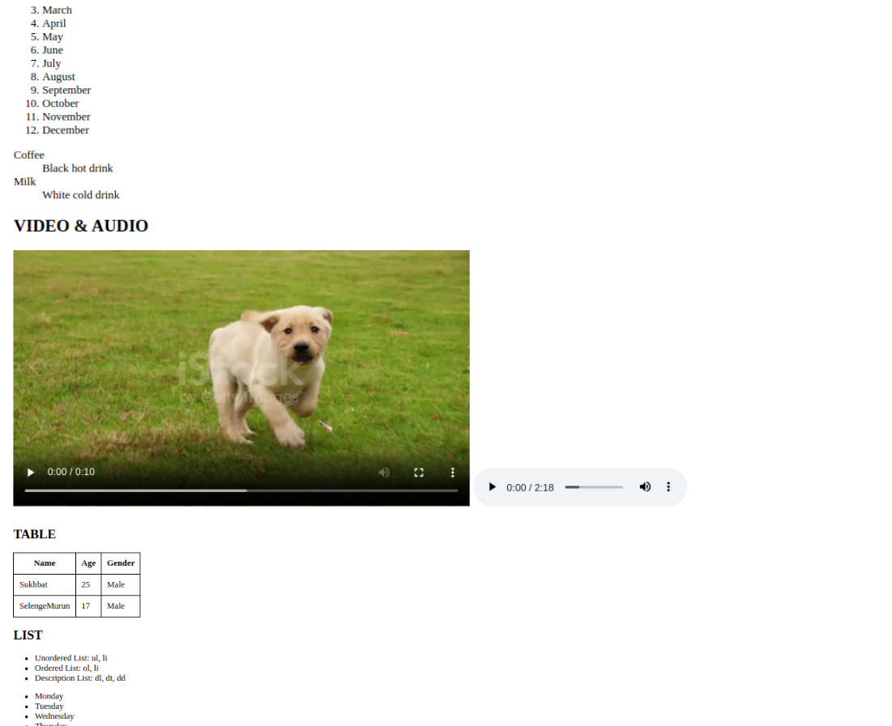

# Хичээл 1: лекц слайд

Environment:

1. Vscode extensions: Live server, Prettier
2. Install git bash
3. Веб зохиомж хавтас үүсгээд vscode дээр нээх

### Slide: https://docs.google.com/presentation/d/1gW2_IRIJiBb33foTqGZB_TQFITSiFy17OZpIRGNTMic/edit?usp=sharing

### Video: https://youtu.be/-AAQxRKrkRc

# Hands-on

1. HTML Basics
2. CSS Basics
3. Formatting Code
4. Inspect Page (devtools) - DOM
5. Heading section: charset, viewport, keyboard, description
6. Text: h1-6, p, span
7. Links: target="_blank", download, image path
8. Images: src, alt
9. Entities: ©, <, >
10. Video & Audio : src, autoplay, controls, loop
12. List : ul, ol, li, dl, dt, dd
13. Table : table, thead, tbody, tr, th, td
## Дасгал:
 
 