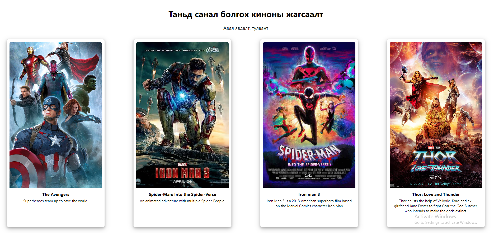
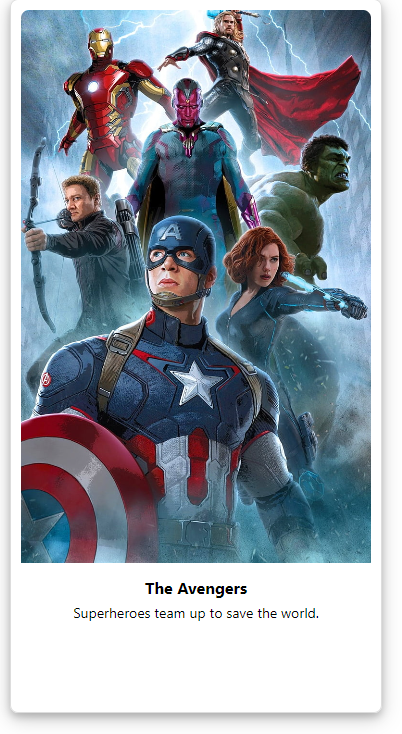
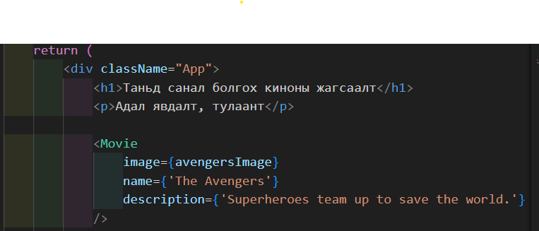
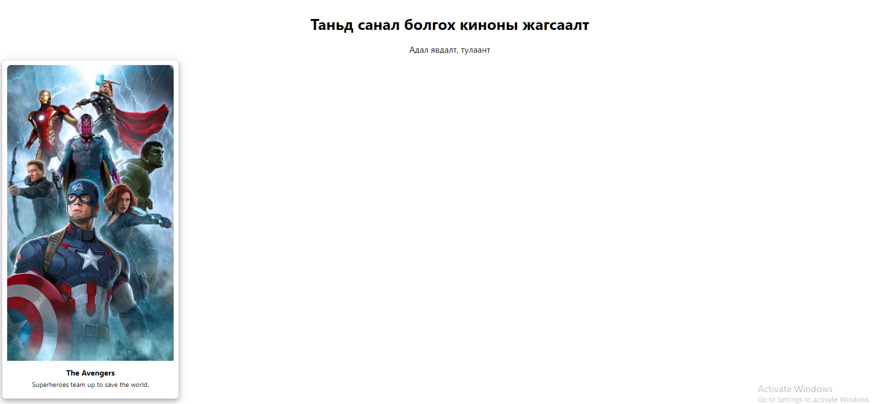
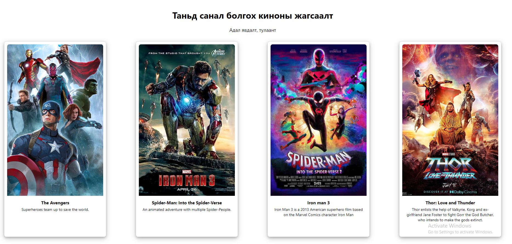

# Lesson 11-1 - React component and props Давталт:
## Өмнөх хичээлийн дасгал ажил тайлбар болон бодолт
<!-- 
- [Kahoot тест өгөх](<https://kahoot.it/challenge/0722189?challenge-id=52e8dc11-25fb-4f0e-bbb7-bfe2b8499817_1700442547734>) -->

## Дасгал: Дуртай киног чинь санал болгодог веб сайт зурж үзэцгээе.


### Movie component: 
- #### Компонент үүсгэж дэлгэцэнд харах: 
    Хамгийн эхлээд 1 ширхэг киног харуулах Movie нэртэй компонент үүсгэж App.js буюу том компонент дээр дуудаж харуулах.  
- #### Компонент-г зурах: 
    Киноны image (зураг), name (нэр), description (тайлбар) гэсэн 3 хэсгээс бүтэх бөгөөд дараах байдлаар харагдана.
    - 
- #### Утга дамжуулах: 
Movie компонент дотор харагдаж буй image, name, description -ний мэдээллийг гаднаас (App.js дотроос) дамжуулж өгөх.



 
- #### Киноны жагсаалт
Movie компонент-г 4 удаа дуудан харгалзах киноны мэдээллийг дамжуулж, жагсаалт болгож дараах байдлаар харуулна.

- Зураг: [images](./images/) хавцас дотор байгаа
- Дараах киноны датаг ашиглана харуулна

```js
import avengersImage from '../../images/avengers.jpg'
import ironmanImg from '../../images/ironman.jpg'
import spidermanImg from '../../images/spider-man.jpg'
import thorImg from '../../images/thor_love_and_thunder_dc.jpg'

    const avengers = {
        image: avengersImage,
        name: 'The Avengers',
        description: 'Superheroes team up to save the world.',
    }
    const spiderman = {
        image: spidermanImg,
        name: 'Spider-Man: Into the Spider-Verse',
        description: 'An animated adventure with multiple Spider-People.',
    }
    const ironman = {
        image: ironmanImg,
        name: 'Iron man 3',
        description: 'Iron Man 3 is a 2013 American superhero film based on the Marvel Comics character Iron Man',
    }
    const thor = {
        image: thorImg,
        name: 'Thor: Love and Thunder',
        description: 'Thor enlists the help of Valkyrie, Korg and ex-girlfriend Jane Foster to fight Gorr the God Butcher, who intends to make the gods extinct.',
    }
```

