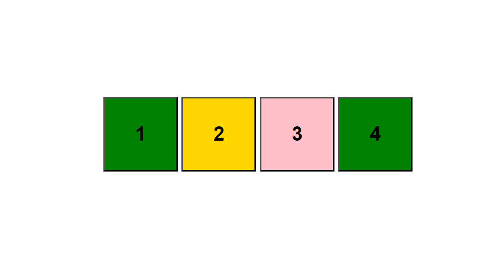
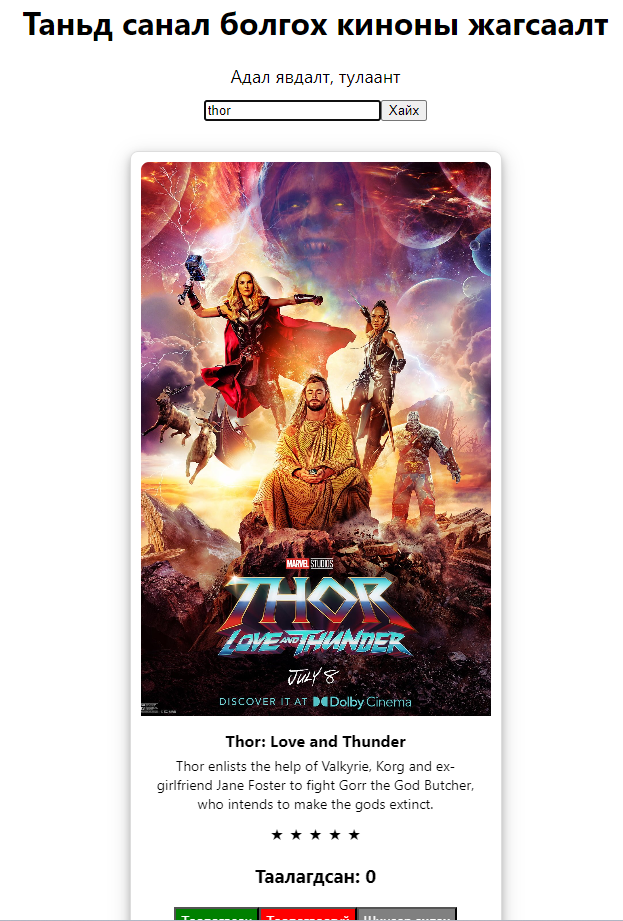
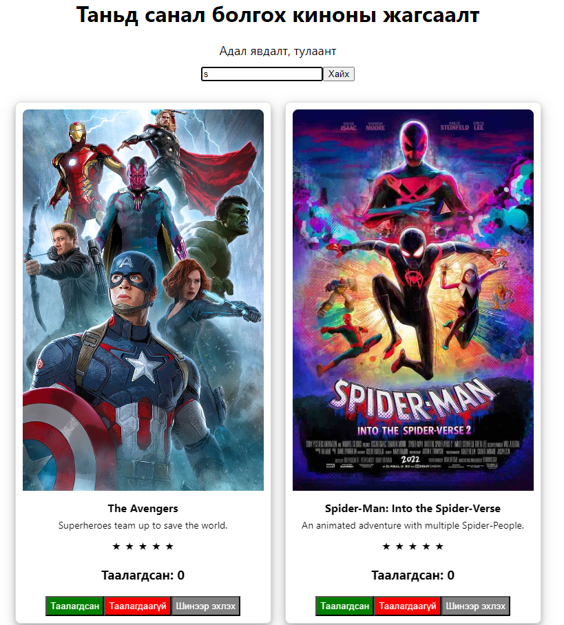

# Хичээл 01: Бататгах хичээл

### Сурсан чадварууд шалгах

1. Component: Компонент үүсгэх, дуудаж харах, css ашиглах

- Box component үүсгэх, дэлгэцэнд харуулах

2. Props: Компонентруу дата дамжуулах

- 3 ширхэг Box харуулаад дотор нь Box 1, Box 2, Box 3 гэсэн текст харуулах

3. map: давталт

- 3 ширхэг Box-г давталтаар дэлгэцэнд харуулах

4. state: Төлөв

- Box компонент дээр дарах үед өнгө нь солигддог байх

5. filter: Массиваас шүүлт хийх буюу box компонентын текстээс хайх

6. Киноны жагсаалтаас бичсэн текстээр хайлт хийх.
  <!--  -->
  
