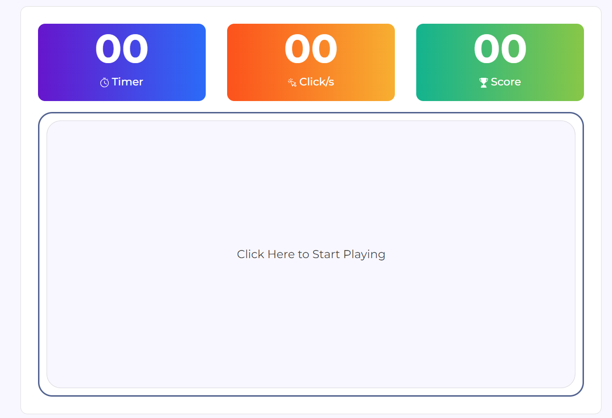
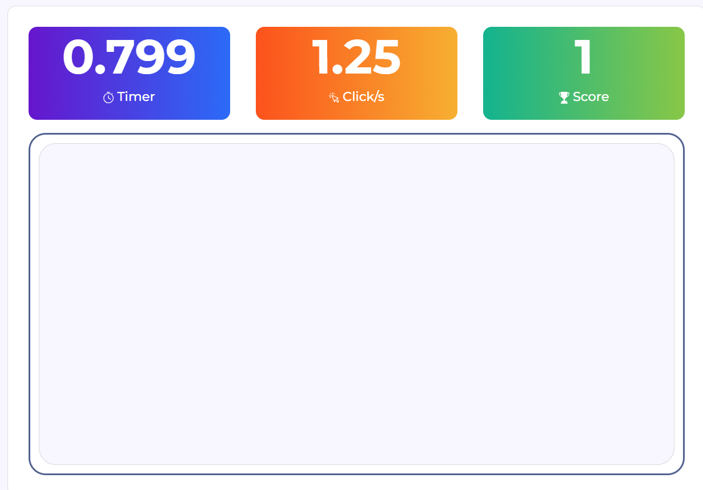

# Click speed тоглоом: 1 Counter + Timer

### Хичээлийн бичлэг: <https://youtu.be/1granYknAmI>


### setInterval: Timer ажиллуулах
```jsx 
  const timerId = setInterval(() => {
          console.log('Hello');
  }, 1000)
```

- Дээрхи жишээн дээр 1 секунд тутамд console-руу "Hello" гэж ажиллах функц ажиллуулж байна
- 1000: Ажиллах давтамжийг заана. 1000 Миллисекунд буюу 1 секунд давтамжтай ажиллана
- timerId: setInterval функцын дугаар

### clearInterval: setInterval функцыг зогсооно
```jsx 
  clearInterval(timerId)
```
### Дасгал ажил: 

1. Линк: <https://clickspeedtest.net/>



