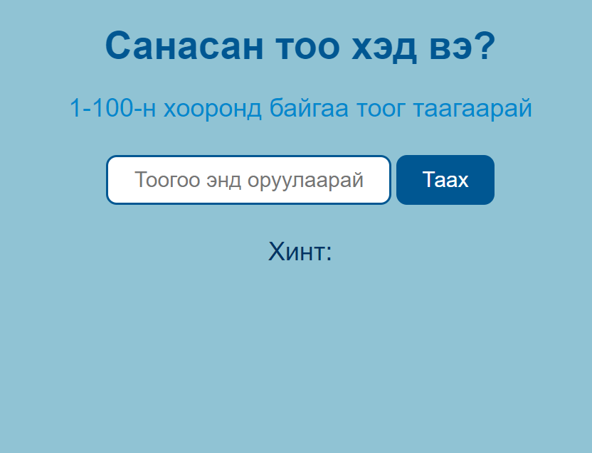
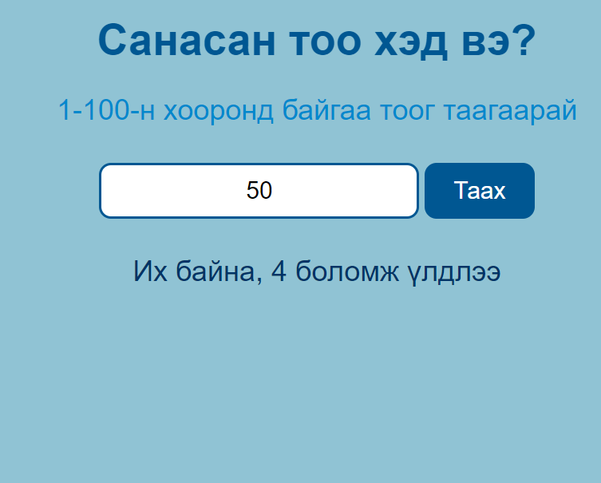
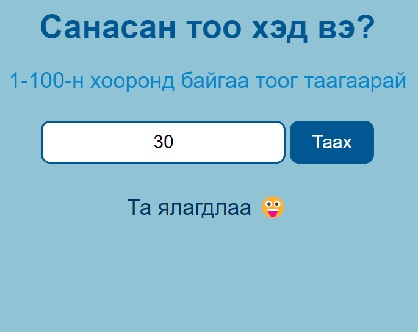
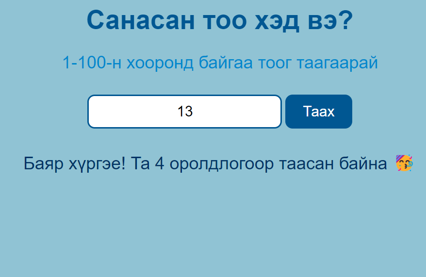

# Санасан тоо таагаарай

### Дасгал бичлэг: <https://youtu.be/fIh4YSTwe24>

### Яаж 1-100 хооронд санамсаргүй тоо санах вэ?

```jsx
const sanamsarguiToo = Math.floor(Math.random() * 100);
```
### Тайлбар:
- Math.random(): 0-1 хооронд санамсаргүй бутархай тоо өгнө.
```jsx
Math.random()
// 0.9551798607561985
Math.random()
// 0.5463444570458271
```

- Math.random() * 100: 0-100 хооронд санамсаргүй бутархай тоо өгнө.
```jsx
Math.random()*100
// 48.730016053106496
Math.random()*100
// 99.95723914004533
```
- Math.floor: Бүхэл утгийг авна
```jsx
Math.floor(3.8)
// 3
Math.floor(10.3)
// 10
Math.floor(Math.random()*100)
// 89
```






